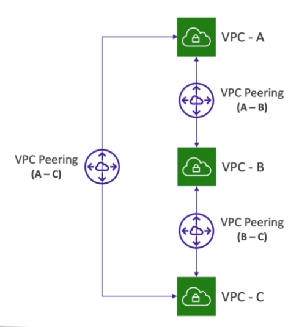

# AWS::EC2::VPCPeeringConnection

- Connect `2 VPCs` privately (within region, cross regions or cross accounts)
- Cannot have overlapping CIDRs
- One VPC `requests` the peer connection and the other vpc `accepts` the peer connection
- `Route table` (of both VPCs) must be updated in order to redirect traffic to the `peering connection`



## Properties

- <https://docs.aws.amazon.com/AWSCloudFormation/latest/UserGuide/aws-resource-ec2-vpcpeeringconnection.html>

```yaml
Type: AWS::EC2::VPCPeeringConnection
Properties:
  PeerOwnerId: String
  PeerRegion: String
  PeerRoleArn: String
  PeerVpcId: String
  Tags:
    - Tag
  VpcId: String
```
