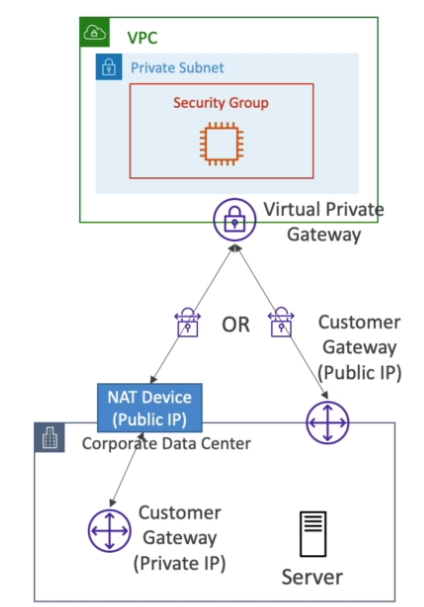
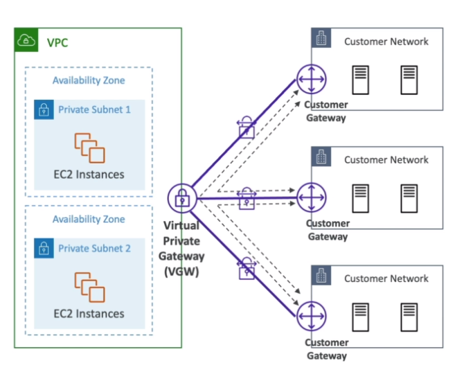

# AWS::EC2::VPNConnection

- **Site to Site VPN (S2S VPN)**
- Links `VPN Gateway` (aws side) to the `Customer Gateway` (corporation side)
- If the Customer Gateway is `public`, use its public ip
- If the Customer Gateway is `private`, use its NAT public IP
- `Route propagation` must be enabled in the VPC



```yaml
Type: AWS::EC2::VPNConnection
Properties:
  CustomerGatewayId: String
  StaticRoutesOnly: Boolean
  Tags:
    - Tag
  TransitGatewayId: String
  Type: String
  VpnGatewayId: String
  VpnTunnelOptionsSpecifications:
    - VpnTunnelOptionsSpecification
```

- **CloudHub**

  - Links `VPN Gateway` (aws side) to the _multiple_ `Customer Gateway` (corporation side)
  - `Hub and spoke` model. Hub can communicate with one another

  

  - To set it up, a `Customer Gateway` must be created for each hub
  - `Dynamic routing` must be enabled for the s2s connections
