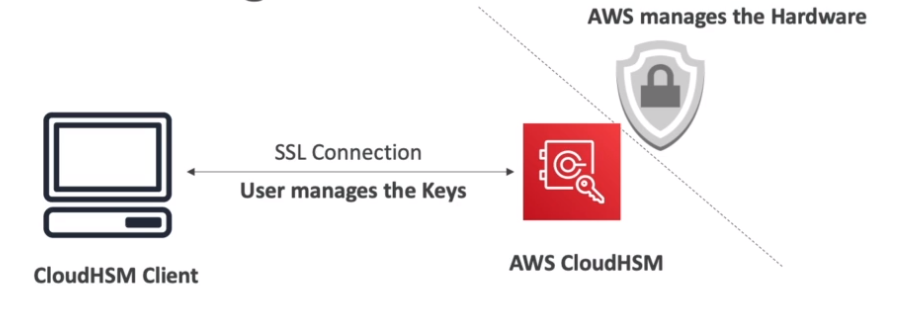

# CloudHSM

- Solution to manage `keys`
- Differently from KMS, it provisions `encryption hardware`
- Dedicated hardware: `Hardware Security Module` (HSM)
- You manage your own keys entirely (`Customer Managed CMK`)
- `Tamper resistant`: FIPS 140-2 Level 3 compliance
- Must use `CloudHSM Client` software
- Good option to use with SSE-C
- Multi-AZ

