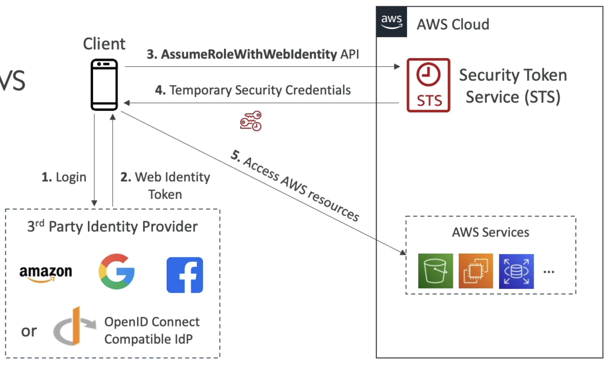
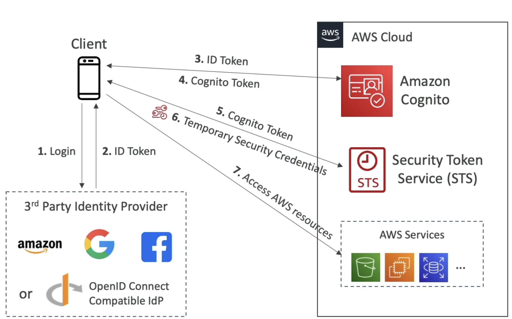

# AWS::IAM::OIDCProvider

- **Web identity**
- Allows users federated by the specified external web identity provider to assume this role to perform actions in this account

- `OIDC` Provider. Also known as `Web Identity Federation`
- In this method, you don't know your customers (e.g., web application in which the user can sign-in directly)
- With that you don’t have to distribute or embed long-term security credentials, such as access keys, in your applications
- Examples:
  - Facebook IdP
  - Google IdP
- The `Cognito` service can be added to the flow before requesting STS. This approach is preferred because:
  - It supports `anonymous users`
  - It supports `MFA`
  - It supports `data synchronization`




```json
// Allow users to access only their own bucket
{
  "Version": "2012-10-17",
  "Statement": [
    {
      "Effect": "Allow",
      "Action": "s3:ListBucket",
      "Resource": "arn:aws:s3:::mybucket",
      "Condition": {
        "StringLike": {
          "s3:prefix": [
            "myapp/${www.amazon.com:user_id}/*"
          ]
        }
      }
    },
    {
      "Effect": "Allow",
      "Action": [
        "s3:GetObject",
        "s3:PutObject",
        "s3:DeleteObject"
      ],
      "Resource": [
        "arn:aws:s3:::mybucket/myapp/${www.amazon.com:user_id}",
        "arn:aws:s3:::mybucket/myapp/${www.amazon.com:user_id}/*"
      ]
    }
  ]
}
```

## Examples

```json
{
  "Version": "2012-10-17",
  "Statement": [
    {
      "Effect": "Allow",
      "Action": "sts:AssumeRoleWithWebIdentity",
      "Principal": {
        "Federated": "arn:aws:iam::123456789012:oidc-provider/oidc.eks.us-east-1.amazonaws.com/id/0123456789ABCDEF0123456789ABCDEF"
      },
      "Condition": {
        "StringEquals": {
          "oidc.eks.us-east-1.amazonaws.com/id/7B4887CC1B7841B1BAEB98263BC64B9C:aud": "sts.amazonaws.com",
          "oidc.eks.us-east-1.amazonaws.com/id/7B4887CC1B7841B1BAEB98263BC64B9C:sub": "system:serviceaccount:kube-system:aws-load-balancer-controller"
        }
      }
    }
  ]
}
```

```json
{
  "Version": "2012-10-17",
  "Statement": [
    {
      "Effect": "Allow",
      "Action": "sts:AssumeRoleWithWebIdentity",
      "Principal": {
        "Federated": "accounts.google.com"
      },
      "Condition": {
        "StringEquals": {
          "accounts.google.com:sub": "111296964555974010651"
        }
      }
    }
  ]
}
```

## Properties

- <https://docs.aws.amazon.com/AWSCloudFormation/latest/UserGuide/aws-resource-iam-oidcprovider.html>

```yaml
Type: AWS::IAM::OIDCProvider
Properties:
  ClientIdList:
    - String
  Tags:
    - Tag
  ThumbprintList:
    - String
  Url: String
```
