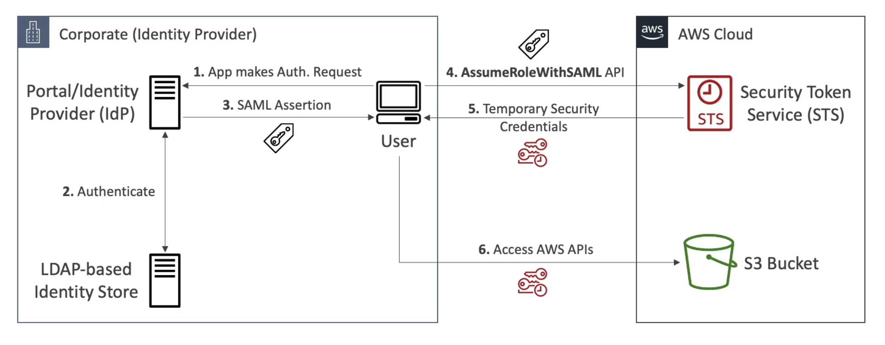
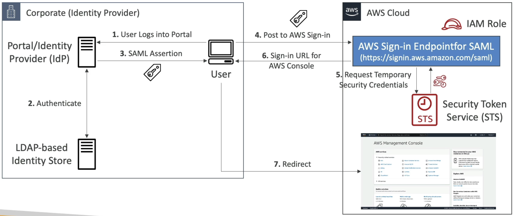

# AWS::IAM::SAMLProvider

- `Security Assertion Markup Language 2.0`
- It's an AWS Resource that describes an `identity provider (IdP)` that supports `SAML 2.0`.
- The `SAML provider` resource that you create with this operation can be used as a `principal` in an IAM role's trust policy. Such a policy can enable `federated users` who sign in using the `SAML IdP` to assume the role. You can create an IAM role that supports `Web-based single sign-on (SSO)` to the AWS Management Console or one that supports API access to AWS.
- Allow users federated with SAML 2.0 from a corporate directory to perform actions in this account

- ARN example: `arn:aws:iam::000000000000:saml-provider/okta`

- The client uses STS to exchange a `saml assertion` for `temporary credentials`
- Examples:
  - Okta
  - Microsoft Active Directory Federations Services (ADFS)




## Properties

- <https://docs.aws.amazon.com/AWSCloudFormation/latest/UserGuide/aws-resource-iam-samlprovider.html>

```yaml
Type: AWS::IAM::SAMLProvider
Properties:
  Name: String
  SamlMetadataDocument: String
  Tags:
    - Tag
```
