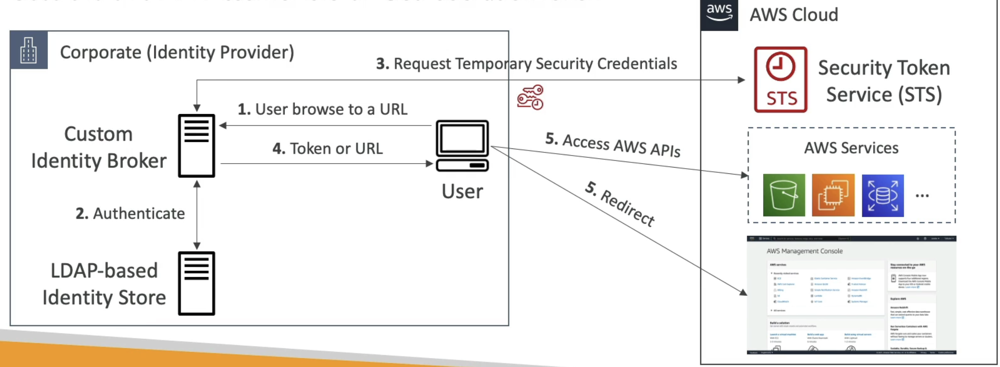

# Identity federation

- Give users outside of AWS permissions to access AWS resources in your account
- `Federated users` are not "real users" (AWS::IAM::User), but entities that have signed-in assuming a role (via an `Identity Provider`, e.g., Okta)
- Federated users can log in aws console normally (if the role permits it)
- **Use cases**
  - If your organization already has its own `identity system`, such as a corporate user directory
  - If you are creating a mobile app or web application that requires access to AWS resources directly

```conf
# aws console menu
Account ID: 0000-0000-0000
Federated user: my-role/my-sub

my-role/my-sub @ my-aws-account-alias
```

## Identity Providers (IdP)

- IAM identity providers (IdPs) allow you to manage your identities outside of AWS (no need to create users, groups in aws)
- External IdP must be registered in IAM and thus creating a `trust relationship`

### OpenID Connect (AWS::IAM::OIDCProvider)

### SAML 2.0 (AWS::IAM::SAMLProvider)

### IAM Identity Center (AWS::SSO::Instance)

### Custom Identity Broker

- Old method, not recommended. Use it only if your IdP is not compatible with SAML 2.0
- The IdP talks directly to the STS and give the token to the user. Uses the `assume-role` or `get-federation-token` on behalf of the user



## Assumable Role

- To allow users from your IdP to access AWS, `create a role with a trust policy that trusts the IAM identity provider`. Then your users can assume the role to get access to the AWS resources in your account. Example:

```json
// Assumable Role Example
{
  "Path": "/",
  "RoleName": "my-role",
  "RoleId": "ABCDEPAC2724CE5NCJXYZ",
  "Arn": "arn:aws:iam::000000000000:role/my-role",
  "CreateDate": "2024-10-15T13:24:07+00:00",
  "AssumeRolePolicyDocument": {
    "Version": "2012-10-17",
    "Statement": [
      {
        "Effect": "Allow",
        "Principal": {
          "Federated": "arn:aws:iam::000000000000:saml-provider/okta" // trust the okta identity provider
        },
        "Action": "sts:AssumeRoleWithSAML",
        "Condition": {
          "StringEquals": {
            "SAML:aud": "https://signin.aws.amazon.com/saml",
            "SAML:sub": "john.doe"
          }
        }
      }
    ]
  }
}
```
