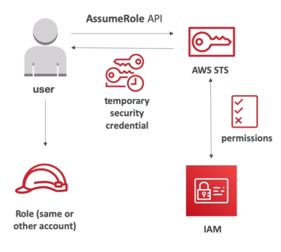
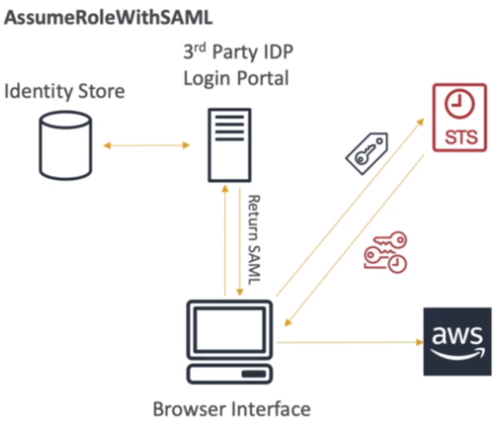

# Security Token Service (STS)

- It's the service used to `endorse the roles` and get the `short term credentials` (temporary credentials)
- By means of STS it is possible to assume a role
- `STS` is used to create and provide `trusted users` with `temporary security credentials` that can control access to your AWS resources.
- STS is an essential service to do **identity federation** based on the `Identity Store` of the `Identity Providers` (IdP)

## Assuming a role

- When a role is assumed, the entity assuming the role `gives up the original permissions` and take the permissions assigned to the assumed role
- In order to assume a role and get a token with the permissions defined in the role, an `Identity Provider` (see AWS::IAM::SAMLProvider or AWS::IAM::OIDCProvider) is needed to guarantee that whoever is trying to assume a role is indeed the person/entity
- An assumable role is defined by the `AssumeRolePolicyDocument` property of the Role

- The assumed role is represented by the ARN `arn:aws:sts::<aws-account>:assumed-role/<role-name>/<sub>`
  - Where "sub" is the sub/principal/session name

- When assuming a role (e.g., via `aws sts assume-role` or `aws sts assume-role-with-saml`) temporary credentials are returned. These credentials can be used to access aws resources
- The AWS `Security Token Service` (STS) is used to assume a role and get the temporary credentials




```json
// temp-credentials.json
{
  "Credentials": {
    "AccessKeyId": "...",
    "SecretAccessKey": "...",
    "SessionToken": "...",
    "Expiration": "2024-11-16T16:57:39+00:00"
  },
  "AssumedRoleUser": {
    "AssumedRoleId": "1234:henrique.vitoi",
    "Arn": "arn:aws:sts::123456789012:assumed-role/my-role/henrique.vitoi"
  },
  "Subject": "henrique.vitoi",
  "SubjectType": "urn:oasis:names:tc:SAML:1.1:nameid-format:x509SubjectName",
  "Issuer": "http://www.okta.com/asdf",
  "Audience": "https://signin.aws.amazon.com/saml",
  "NameQualifier": "..."
}
```

```shell
export AWS_ACCESS_KEY_ID=$(jq -r '.Credentials.AccessKeyId' temp-credentials.json)
export AWS_SECRET_ACCESS_KEY=$(jq -r '.Credentials.SecretAccessKey' temp-credentials.json)
export AWS_SESSION_TOKEN=$(jq -r '.Credentials.SessionToken' temp-credentials.json)

cat >> ~/.aws/credentials <<EOL
[default]
aws_access_key_id = $AWS_ACCESS_KEY_ID
aws_secret_access_key = $AWS_SECRET_ACCESS_KEY
aws_session_token = $AWS_SESSION_TOKEN
EOL
```

- The temporary credentials can be valid between `15 minutes` to `12 hours`

## Session Tags

- Session tags are key-value pair attributes that you pass when you assume an IAM role or federate a user in AWS STS. The session generated has this tag embedded in the request context as a key `aws:PrincipalTag`
- You can use the `aws:PrincipalTag` key in the `Condition` element of your policies to allow or deny access based on those tags
- Generate sessions with tags using the `--tags` flag for `aws sts assume-role`

```json
// Your Policy
{
  ...
  "Condition": {
    "StringEquals": {
      "aws:PrincipalTag/Department": "HR"
    }
  }
}
```
