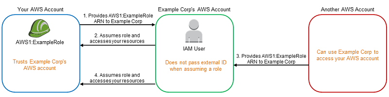

# Cross-account Permissions

## The confused deputy problem

- <https://docs.aws.amazon.com/IAM/latest/UserGuide/confused-deputy.html>
- It's a security issue where an entity that doesn't have permission to perform an action can coerce a more-privileged entity to perform the action
- It happens when a legitimate 3rd party assumes the role of your account thinking it's the role of another (malicious) account.
- This happens because the malicious account have provided to the 3rd party actor the same role ARN as your account (which isn't a secret)

## External ID

- Prevents the confused deputy problem
- The `external ID` is a secret ID shared between you and another legitimate 3rd party account
- When the 3rd party assumes your role they need to provide this `external-id`
