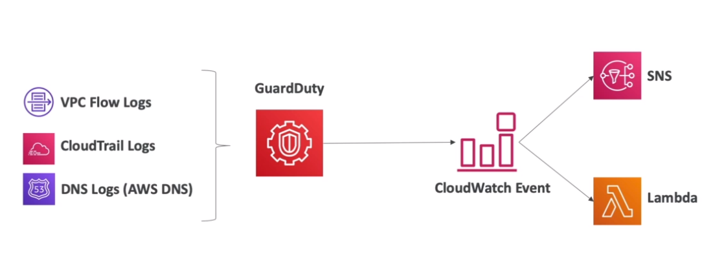

# AWS::GuardDuty::Detector

- Intelligent `threat discovery` to protect your AWS account.E.g., cryptocurrency attacks
- Uses `ML` to detect anomaly
- Events can be setup with `Cloud Watch Events Rules`



- GuardDuty can be:
  - `Disabled`: delete all remaining data
  - `Suspended`: stop the service but does not delete existing finding and configurations

- **Logs to be analyzed**
  - `CloudTrail logs`
  - `VPC Flow logs`
  - `DNS logs`

## Properties

- <https://docs.aws.amazon.com/AWSCloudFormation/latest/UserGuide/aws-resource-guardduty-detector.html>

```yaml
Type: AWS::GuardDuty::Detector
Properties:
  DataSources:
    CFNDataSourceConfigurations
  Enable: Boolean
  Features:
    - CFNFeatureConfiguration
  FindingPublishingFrequency: String
  Tags:
    - TagItem
```

### DataSources

- Data stored in S3 bucket
