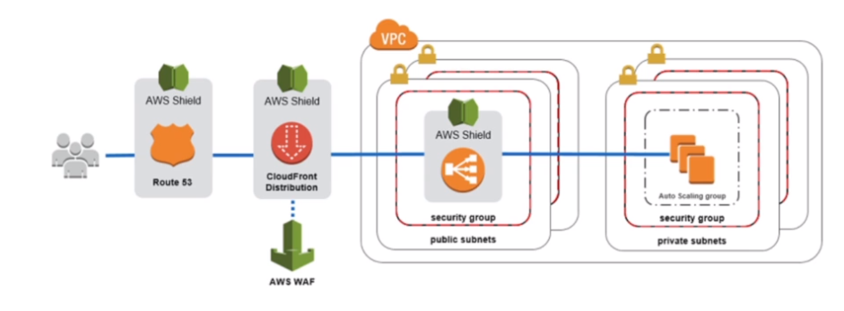

# AWS::FMS::Policy

- **Firewall Manager**

- Centrally manage EC2 `Security Groups` (firewall rules) and AWS `Shield Advanced` across all `AWS accounts` in your AWS `Organization`:
  - AWS WAF rules
  - AWS Shield Advanced protection
  - Security groups
  - AWS Network Firewall rules
  - Amazon Route 53 Resolver DNS Firewall rules.

## Properties

- <https://docs.aws.amazon.com/AWSCloudFormation/latest/UserGuide/aws-resource-fms-policy.html>

```yaml
Type: AWS::FMS::Policy
Properties:
  DeleteAllPolicyResources: Boolean
  ExcludeMap:
    IEMap
  ExcludeResourceTags: Boolean
  IncludeMap:
    IEMap
  PolicyDescription: String
  PolicyName: String
  RemediationEnabled: Boolean
  ResourcesCleanUp: Boolean
  ResourceSetIds:
    - String
  ResourceTags:
    - ResourceTag
  ResourceType: String
  ResourceTypeList:
    - String
  SecurityServicePolicyData:
    SecurityServicePolicyData
  Tags:
    - PolicyTag
```

### SecurityServicePolicyData

#### WAFV2

- **Web Application Firewall**
- Protect `webapps` from common exploits (`Layer 7`)
  - `SQL injection`
  - `Cross-Site Scripting` (XSS)
- Can be deployed on:
  - `ALB`
  - `API Gateway`
  - `CloudFront`
- **Web ACL** (Access Control List)
  - Rules
    - IP addresses
    - HTTP headers
    - HTTP body
    - URI strings
  - Size constraints, geo-match, etc

#### SHIELD_ADVANCED

- Protect against DDoS (`Distributed Denial of Service`) attacks

- **Tiers**
  - `Standard`
    - Free
    - Activated by default
  - `Advanced`
    - Optional DDoS `mitigation` service
    - DDoS `response team` 24/7
    - Reimburse over high fees due to the attack
    - Protect against more sophisticated attacks


