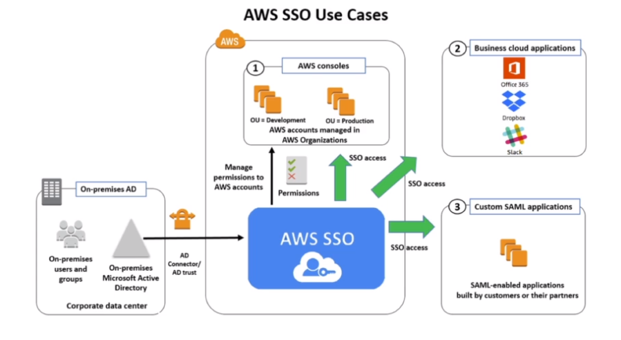

# AWS::SSO::Assignment

- Log once and have access to multiple accounts
- Supports SAML 2.0 markup
- Integration with `AD`
- Centralized auditing with Cloudtrail
- Allow access to multiple account at once



- **SSO vs. AssumeRoleWithSAML**


## Properties

- <https://docs.aws.amazon.com/AWSCloudFormation/latest/UserGuide/aws-resource-sso-assignment.html>

```yaml
Type: AWS::SSO::Assignment
Properties:
  InstanceArn: String
  PermissionSetArn: String
  PrincipalId: String
  PrincipalType: String
  TargetId: String
  TargetType: String
```
