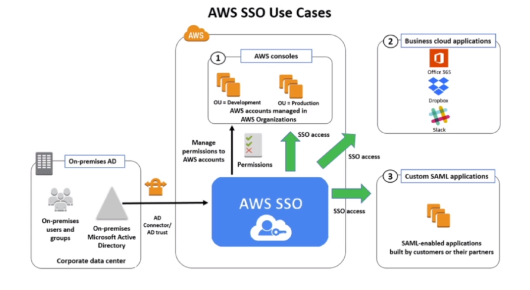
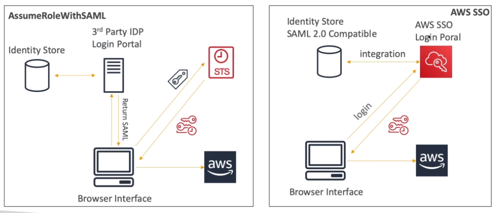

# AWS::SSO::Instance

> "IAM Identity Center" is the successor to "AWS Single Sign-On" (SSO)

- Log once and have `access to multiple accounts`. Allow access to multiple account at once
- Allows centralized auditing with Cloudtrail
- You can create only one instance per account and across all AWS Regions.



## IdPs

- SAML 2.0
- AD
- ...

## SSO vs. AssumeRoleWithSAML



## Properties

- <https://docs.aws.amazon.com/AWSCloudFormation/latest/UserGuide/aws-resource-sso-instance.html>

```yaml
Type: AWS::SSO::Instance
Properties:
  Name: String
  Tags:
    - Tag
```
