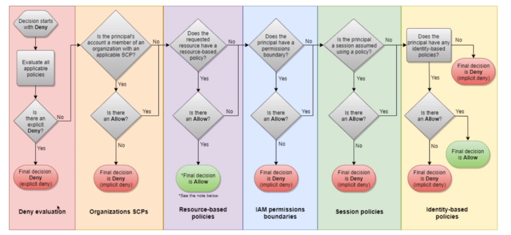
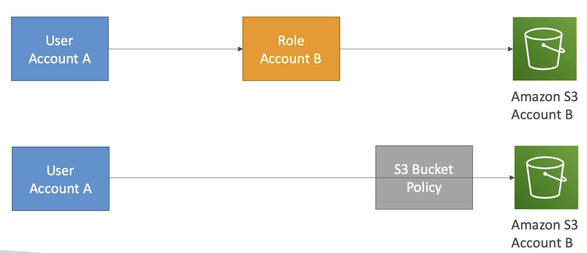

# AWS::IAM::Policy

- IAM is a global service
- Defines an `identity-based inline policy`
- Always use the `grant least privilege principle` when creating policies.
  - Use IAM Access Analyzer(AWS::AccessAnalyzer::Analyzer) to help with that

## Policy Evaluation



## Policy types

- **Identity-Based Policies**
  - These policies are attached to IAM identities (user, group, or role)
  - `Managed Policy`: AWS Managed or Customer Managed (AWS::IAM::ManagedPolicy)
  - `Inline Policy`: can be created on the fly, so that the policy is created only for that entity and cannot be reused (AWS::IAM::Policy)

- **Resource-Based Policies**
  - These policies are attached to AWS resources (e.g., s3)
  - This not what AWS::IAM::Policy creates
  - `S3 Bucket Policies`
  - `SQS Queue Policies`
  - `IAM Role Trust Policies`
  - `AWS KMS Key Policies`
  - And many others. Refer to the documentation of the resource policy directly
  

## Properties

- <https://docs.aws.amazon.com/AWSCloudFormation/latest/UserGuide/aws-resource-iam-policy.html>

```yaml
Type: AWS::IAM::Policy
Properties:
  Groups:
    - String
  PolicyDocument: Json
  PolicyName: String
  Roles:
    - String
  Users:
    - String
```

### PolicyDocument

- <https://awspolicygen.s3.amazonaws.com/policygen.html>
- <https://policysim.aws.amazon.com/>
- All the available actions can be found at <https://docs.aws.amazon.com/service-authorization/latest/reference/list_awsfaultinjectionservice.html>

```json
{
  "Version": "2012-10-17",
  "Id": "S3-Read-Access", // optional
  "Statement": [
    {
      // Identifier (optional)
      "Sid": "MyStatement",

      // Effect (allow or deny)
      // Explicit `DENY` have precedence over any `ALLOW`
      "Effect": "Allow",

      // Actions
      "Action": [
        "s3:Get*",
        "s3:List*"
      ],

      // "NotAction" is used when you want to allow in a following statement for certain actions. If we used "Deny Action" it would take precedent over any other statement
      "NotAction": [
        "iam:*",
        "organizations:*",
        "account:*"
      ],

      // Resource
      "Resource": "arn:aws:s3:::my-bucket/*", // S3 Object Level Permission (all files)

      // Principal
      "Principal": {
        "AWS": [
          "arn:aws:iam::123456789012:root" // account/user/role this policies applies to
        ]
      },

      // Condition (when this policy is in effect)
      "Condition": {
        "StringEquals": {
          "aws:RequestedRegion": [
            "eu-central-1",
            "eu-west-1"
          ],
          "ec2:ResourceTag/Project": "DataAnalytics",
          "aws:PrincipalTag/Department": "Data"
        },
        "BoolIfExists": {
          "aws:MultiFactorAuthPresent": false
        },
        "NotIpAddress": {
          "aws:SourceIp": [
            "192.0.2.0/24",
            "203.0.113.0/24"
          ]
        }
      }
    }
  ]
}
```

#### Conditions

- StringEquals, StringNotEquals, StringLike
- NumericEquals, NumericNotEquals, NumericLessThan
- DateEquals, DateNotEquals, DateLessThan
- Bool, BoolIfExists
- IpAddress, NotIpAddress
- ArnEquals, ArnLike
- Null

#### Variables & Tags

- The variable is replaced by a value depending on the context in which the policy is used
- Some variables are `tag-based`. The tag is applied to some variables (example: `aws:PrincipalTag/owner`)

- **AWS Specific**
  - `aws:CurrentTime`
  - `aws:TokenIssueTime`
  - `aws:principaltype`
  - `aws:PrincipalTag/<tag>`
  - `aws:SecureTransport`
  - `aws:MultiFactorAuthPresent`
  - `aws:SourceIp`
  - `aws:userid`

- **Service Specific**
  - `s3:prefix`
  - `s3:max-keys`
  - `s3:x-amz-acl`
  - `sns:Endpoint`
  - `sns:Protocol`
  - `ec2:SourceInstanceARN`
  - `ec2:ResourceTag/<tag>`

- You can use variables for:
  - _Replacing it for values_. E.g., `"Resource": "arn:aws:s3:::mybucket/${aws:username}/*"`
  - _Using it as conditions_. E.g., `"Condition":{"StringNotEquals":{"s3:ExistingObjectTag/Team":"${aws:PrincipalTag/Team}"}}}`

##### ${aws:username}

```json
// Allow users access to their buckets only
{
  "Resource": "arn:aws:s3:::mybucket/${aws:username}/*"
}
```

##### ${aws:PrincipalTag/tag-key}

```json
{
  "Condition": {
    "StringLike": {
      "s3:prefix": [ "${aws:PrincipalTag/team}/*" ]
    },
    "StringEquals": {
      "s3:ExistingObjectTag/owner": "${aws:PrincipalTag/owner}"
    }
  }
}
```
