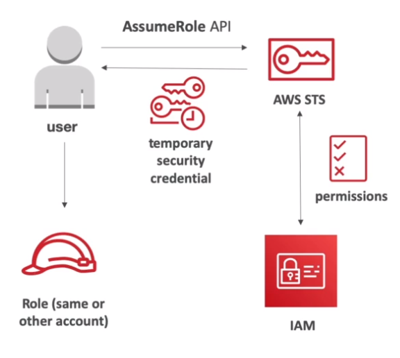

# AWS::IAM::Role

- `Role` is an identity intended to be used/assumed by another entity
  - E.g., give an EC2 instance permission to access an S3 bucket
- Roles have `short term credentials` (differently from users that have long term credentials)
- A role is associated with a `policy`

- <arn:aws:iam:123456789012:role:my-role>

## Trusted Entity Type

- `AWS service`
  - Allow AWS services like EC2, Lambda, or others to perform actions in this account.
- `AWS account`
  - Allow entities in other AWS accounts belonging to you or a 3rd party to perform actions in this account.
- `Web identity`
  - Allows users federated by the specified external web identity provider to assume this role to perform actions in this account.
- `SAML 2.0 federation`
  - Allow users federated with SAML 2.0 from a corporate directory to perform actions in this account.
- `Custom trust policy`
  - Create a custom trust policy to enable others to perform actions in this account.

## Assuming a role

- When you assume a role (user, application or service), you give up your original permissions and take the permissions assigned to the role
  - Differently from `resource based policies` in which the policies add up to your already possessed permissions
- In order to assume a role and get a token with the permissions defined in the role, an `Identity Provider` is needed to guarantee that whoever is trying to assume a role is indeed the person/entity
- An assumable role is defined by the `AssumeRolePolicyDocument` property (see below)
- An assumed role has the arn format `arn:aws:sts::<aws-account>:assumed-role/<role-name>/<sub>`

## Identity Providers (IdP)

- Generate token with `limited` and `temporary` access to AWS resources
- Token is valid up to `1 hour`, must be `refreshed` after this
- Identity Providers authenticate with AWS (by means of STS). Example: Okta via SAML

- Identity Providers
  - _SAML 2.0_: the client exchange a saml token for an sts token
  - _Custom Identity Broker_: the IdP talks directly to the sts and give the token to the user
  - _Web Identity Federation_: login on fb, google, etc (not recommended! Use Cognito instead)
  - _SSO_
  - _AD_: database of objects (users, files, printers, etc)

## STS

- `Security Token Service` (STS) is the service used to endorse the roles and get the short term credentials (temporary credentials)

- APIs
  - **AssumeRole**
    - User will use a role within your account or cross-account
    
  - **AssumeRoleWithSaml**: return credentials for users logged in SAML
  - **AssumeRoleWitWebIdentity**: returns credentials for users logged with IdP (fb, google, etc)
  - **GetSessionToken**: for MFA

## Properties

- <https://docs.aws.amazon.com/pt_br/AWSCloudFormation/latest/UserGuide/aws-resource-iam-role.html>

```yaml
Type: AWS::IAM::Role
Properties:
  AssumeRolePolicyDocument: Json
  Description: String
  ManagedPolicyArns:
    - String
  MaxSessionDuration: Integer
  Path: String
  PermissionsBoundary: String
  Policies:
    - Policy
  RoleName: String
  Tags:
    - Tag
```

### AssumeRolePolicyDocument (Trust Policy)

- It's the document that describes what/how entities that can assume this role
- It specifies the conditions under which an entity (like an AWS service, another IAM role, or a user) can take on the permissions associated with the role.
- It specifies the `principal` (the AWS service or account) that is allowed to assume the role

```json
// Allow EKS clusters to assume the role
{
  "Version": "2012-10-17",
  "Statement": [
    {
      "Effect": "Allow",
      "Principal": {
        "Service": [
          "eks.amazonaws.com"
        ]
      },
      "Action": "sts:AssumeRole"
    }
  ]
}
```

```json
// Allow an IdP (e.g., Okta) to authentication a user via SAML
{
  "Version": "2012-10-17",
  "Statement": [
    {
      "Effect": "Allow",
      "Principal": {
        "Federated": "arn:aws:iam::307096125112:saml-provider/okta"
      },
      "Action": "sts:AssumeRoleWithSAML",
      "Condition": {
        "StringEquals": {
          "SAML:sub": "henrique.vitoi",
          "SAML:aud": "https://signin.aws.amazon.com/saml"
        }
      }
    }
  ]
}
```

### ManagedPolicyArns (Permission policies)

- This is where you attach `managed policies` to the role (by its arn)

```shell
aws iam list-attached-role-policies --role-name henrique.vitoi-dev-role
```

### Policies

- This is where you define `inline policies` directly attached to the role
- These inline policies cannot be reused in other roles

```shell
aws iam list-role-policies --role-name henrique.vitoi-dev-role
```

### PermissionsBoundary

- Supported for `users` and `roles` (not groups)
- Define the maximum permissions an entity can get
- `Permission boundary` (maximum scope) + `permission policies`


- Use cases
  - Delete responsibilities to non administrators within their permissions boundaries
  - Allow self-assign policies and manage their own permissions
