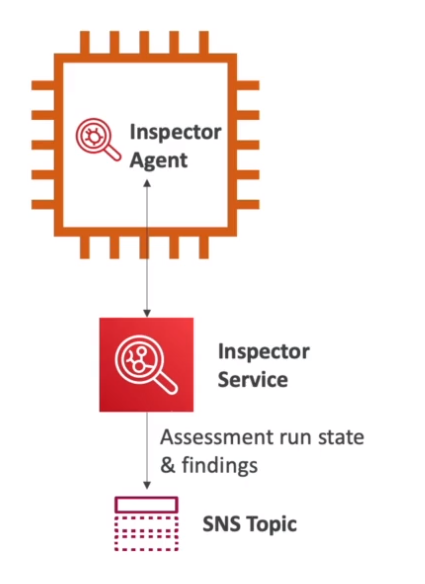

# AWS::Inspector::AssessmentTemplate

- `Security Assessments` for EC2 instances!
- Spot `vulnerabilities` with the OS AMI
- Spot `unintended network access`

- The **Inspector Agent** must be installed in the EC2 instance

