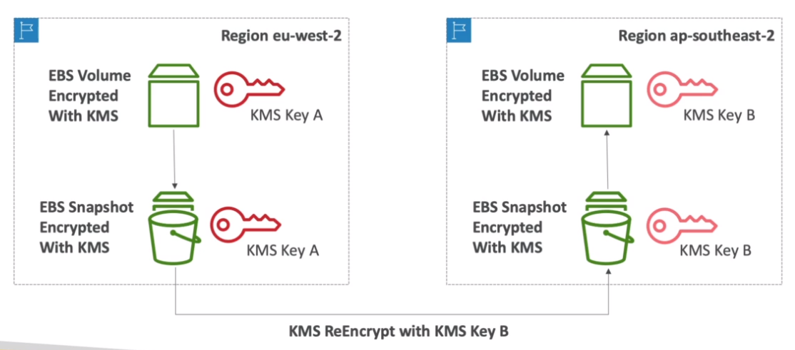

# AWS::KMS::ReplicaKey'

- KMS keys are bound to a region
- In order to copy resource `snapshots` to another regions, a new KMS key in the new region must be set
- The new key must also have the correct policies

