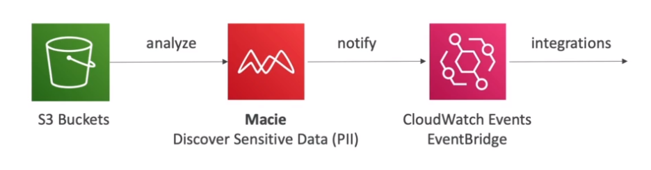

# AWS::Macie::Session

- `Data security` & `Data privacy` service
- Uses `Machine Learning` to discover and protect sensitive data
- Alert about `Personally Identifiable Information` (PII) being `exposed`
- Fully managed

