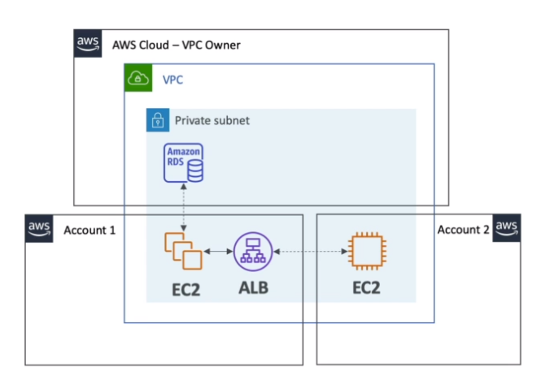

# AWS::RAM::ResourceShare

- `Resource Access Manager` (RAM)
- `Share AWS resources` with other AWS accounts in the same `AWS Organization`
- Avoids resource duplication
- Accounts with access to the shared resource cannot view, modify or delete
- E.g., subnets, transit gateway, etc

- **VPC Sharing**

  - Network is shared, anything deployed in the VPC can be accessed by the other accounts resources

  

## Properties

- <https://docs.aws.amazon.com/AWSCloudFormation/latest/UserGuide/aws-resource-ram-resourceshare.html>

```yaml
Type: AWS::RAM::ResourceShare
Properties:
  AllowExternalPrincipals: Boolean
  Name: String
  PermissionArns:
    - String
  Principals:
    - String
  ResourceArns:
    - String
  Sources:
    - String
  Tags:
    - Tag
```
