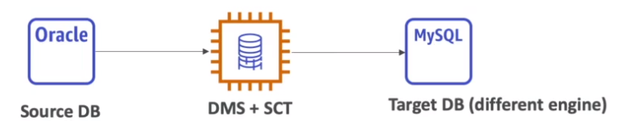

# Database Migration Service (DMS)

- Migrate database `from on-premise` `to aws`
- Migration types
  - `Homogeneous migration`: e.g., oracle to oracle
  - `Heterogeneous migration`: e.g., microsoft sql server to aurora
- The **DMS software** runs in an `EC2 Instance` to perform the migration operations

## Replication Instance

- It's the configuration of the EC2 instances that will perform the operations
- Similar to Kafka Connect Cluster

## Database Migration Task

- A `migration task` runs in a Replication Instance
- A `source endpoint` and a `target endpoint` is defined
- Similar to Kafka Connector
- **Migration Task**
  - Migrate existing data
  - Migrate existing data and replicate ongoing changes (_CDC - Change Data Capture_)
  - Replicate data changes only

## Schema Conversion Tool (SCT)

- Convert the `database schema` from one engine to another
- If migrating to the same database engine (homogeneous migration) SCT is not needed

