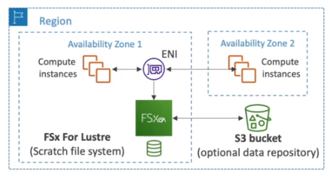
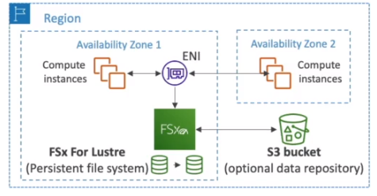

# AWS::FSx::FileSystem

## Properties

- <https://docs.aws.amazon.com/AWSCloudFormation/latest/UserGuide/aws-resource-fsx-filesystem.html>

```yaml
Type: AWS::FSx::FileSystem
Properties:
  BackupId: String
  FileSystemType: String
  FileSystemTypeVersion: String
  KmsKeyId: String
  LustreConfiguration:
    LustreConfiguration
  OntapConfiguration:
    OntapConfiguration
  OpenZFSConfiguration:
    OpenZFSConfiguration
  SecurityGroupIds:
    - String
  StorageCapacity: Integer
  StorageType: String
  SubnetIds:
    - String
  Tags:
    - Tag
  WindowsConfiguration:
    WindowsConfiguration
```

### FileSystemType

#### WINDOWS

- `FSx for Windows`: windows file system shared drive
- Supports `SMB` and `NTFS` protocols
- Supports `AD` integration, `ACL` and `user quotas`
- Supports `Multi-AZ`

#### LUSTRE

- Lustre is a `parallel distributed file system`
- For large-scale computing
- Lustre (Linux + Cluster)
- The throughput increases as the total storage increases

- Use cases

  - `Machine Learning`
  - `High Performance Computing` (HPC)
  - Video Processing, Financial Modeling, Electronic Design Automation, ...

- Seamless `integration with S3` (read, write, ...)

### StorageCapacity

- `Scratch File System`
  - Temporary storage
  - Data not replicated
  - High burst (6x faster, 200MBps per TiB)
  - Short-term processing



- `Persistent File System`
  - Long-term storage
  - Data replicated within same AZ
  - Replace failed files within minutes
  - For sensitive data


