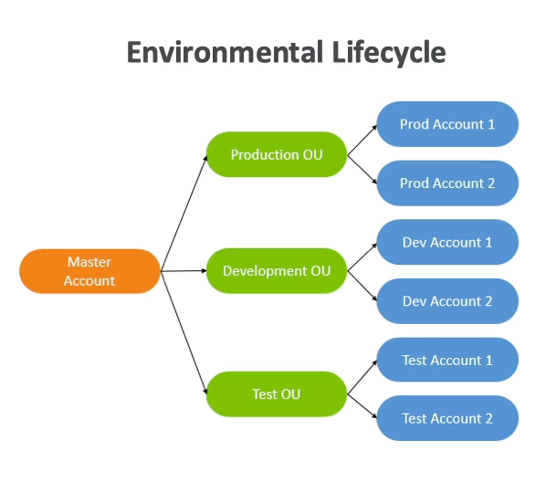
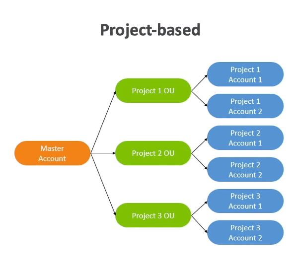
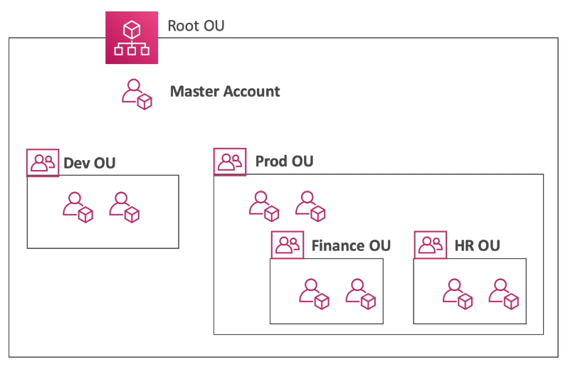

# Organizations

- Allow managing multiple AWS accounts
- One `main account` and other `member accounts`
- Member accounts can be part of only one organization
- `Consolidated Billing` across all accounts (single payment method)
  - Volume discounts for EC2, S3, etc
- Accounts can be `migrated` between organizations

## Multi Account Strategies

- Create accounts per `department`, `dev/test/prod`, `per VPC`, ...
- Per account `service limits`
- Isolated account for `logging`

- **Per Business Unit**


- **Per Environmental Lifecycle**



- **Per Project**



## Organization Units (OU)

- An `OU` is a group
- An OU contains multiple `accounts`
- It's best practice to keep the `master account` under the `root OU`



## Service Control Policies (SCP)

- `Whitelists` or `Blacklists` IAM action
- The `SCP` is applied to an `OU` or directly to an `account`
- OUs at the `master account` take no effect
- Use cases

  - Restrict access to certain services (E.g., can't use EMR)
  - Enforce PCI compliance by explicitly disabling services

- **SCP Hierarchy**
  

- SCP do not affect service-linked role
- Affect all users and roles, including root user

```json
{
  "Version": "2012-10-17",
  "Statement": [
    {
      "Sid": "AllowsAllActions",
      "Effect": "Allow",
      "Action": "*",
      "Resource": "*"
    },
    {
      "Sid": "DenyDynamoDB",
      "Effect": "Deny",
      "Action": "dynamodb:*",
      "Resource": "*"
    }
  ]
}
```

## VPC Sharing

- Share subnets with other accounts belonging to the same parent organization
