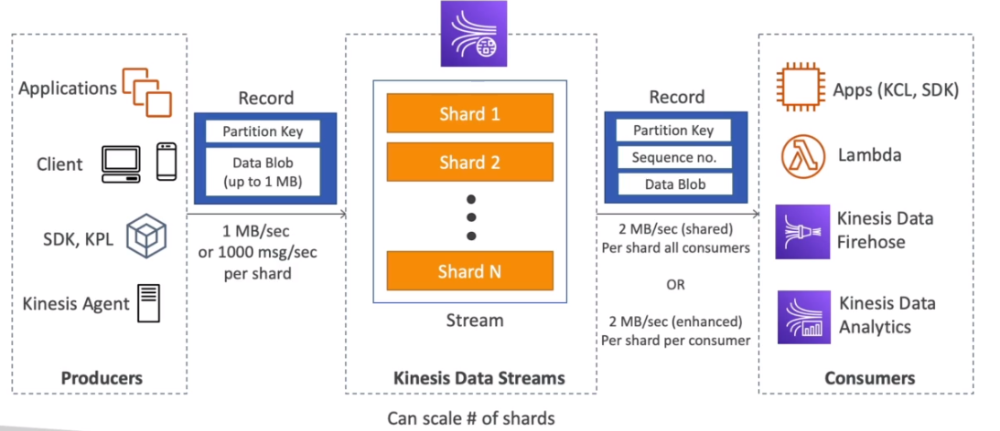

# AWS::Kinesis::StreamConsumer

- Similar to `Kafka`
- Capture, process and store data streams
- `Stream` is made up of `shards` (partitions). The more shrads, the more throughput
- Provides `ordering of records` and the ability to `read and/or replay records`

- **Modes**

  - `Standard`: consumers pull data
  - `Enhanced-fan out`: data is pushed to consumers
