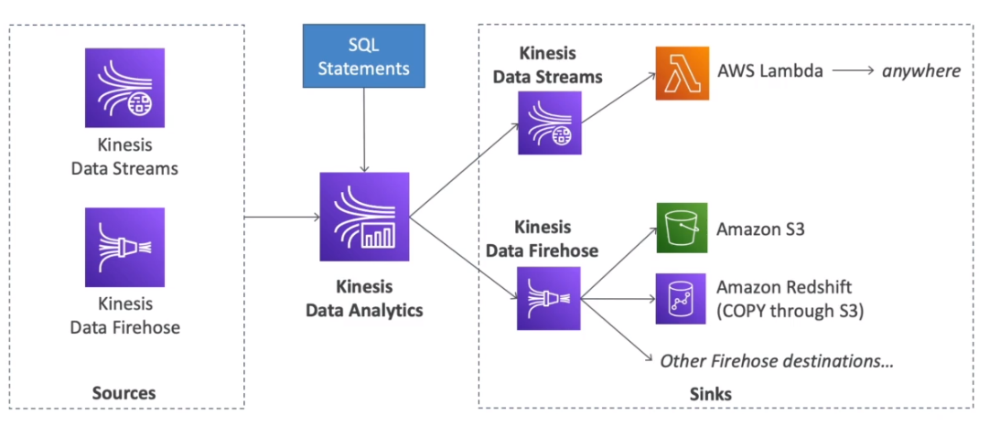

# AWS::KinesisAnalyticsV2::Application

- Similar to `kSQL`
- Analyze data streams with `SQL` or `Flink`
- Use cases
  - Time-series analytics
  - Real-time dashboards
  - Real-time metrics



```yaml
Type: AWS::KinesisAnalyticsV2::Application
Properties:
  ApplicationConfiguration: ApplicationConfiguration
  ApplicationDescription: String
  ApplicationMode: String
  ApplicationName: String
  RuntimeEnvironment: String
  ServiceExecutionRole: String
  Tags:
    - Tag
```
