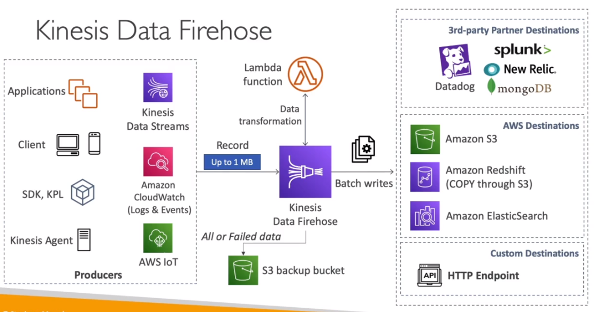

# AWS::KinesisFirehose::DeliveryStream

- Similar to `Kafka Connect`
- Load data streams into storages
  - AWS Destinations (S3, Redshift, ElasticSearch)
  - 3rd-party destinations (datadog, splunk, mongodb, new relic)
  - Custom destinations (http endpoint)
- Supports `aws lambda` for data processing if necessary
- Failed data can be sent to S3 bucket

