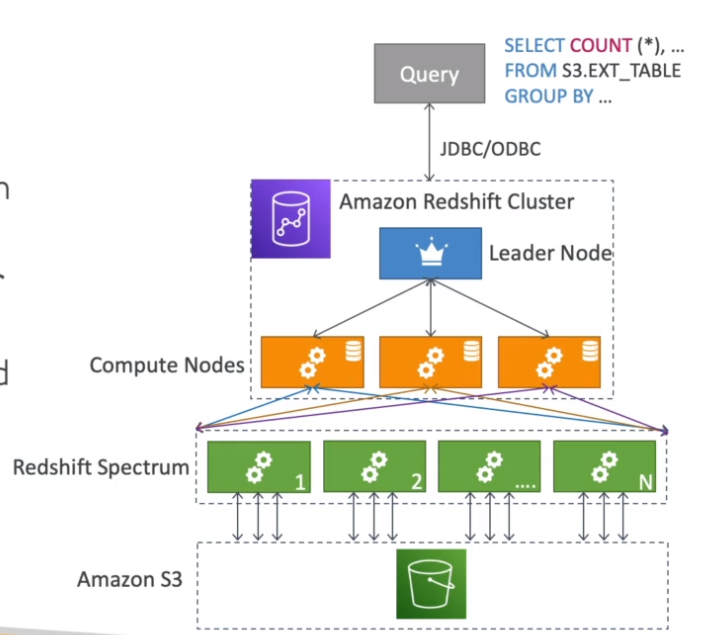

# AWS::Redshift::Cluster

- `Data Warehousing` solution
- `Online Analytical processing` (OLAP) based on PostgreSQL
- Petabytes of data
- `Columnar` data storage
- `Massively Parallel Query Execution` (MPP)
- SQL interface to perform queries
- Great integration with tools like `AWS Quicksight` and `Tableau`
- Faster than Athena thank to indexes

## Redshift Spectrum

- Directly query from S3, no need to load

```sql
SELECT count(*)
FROM S3.EXT_TABLE
GROUP BY ...
```



## Properties

- <https://docs.aws.amazon.com/AWSCloudFormation/latest/UserGuide/aws-resource-redshift-cluster.html>

```yaml
Type: AWS::Redshift::Cluster
Properties:
  AllowVersionUpgrade: Boolean
  AquaConfigurationStatus: String
  AutomatedSnapshotRetentionPeriod: Integer
  AvailabilityZone: String
  AvailabilityZoneRelocation: Boolean
  AvailabilityZoneRelocationStatus: String
  Classic: Boolean
  ClusterIdentifier: String
  ClusterParameterGroupName: String
  ClusterSecurityGroups:
    - String
  ClusterSubnetGroupName: String
  ClusterType: String
  ClusterVersion: String
  DBName: String
  DeferMaintenance: Boolean
  DeferMaintenanceDuration: Integer
  DeferMaintenanceEndTime: String
  DeferMaintenanceStartTime: String
  DestinationRegion: String
  ElasticIp: String
  Encrypted: Boolean
  Endpoint:
    Endpoint
  EnhancedVpcRouting: Boolean
  HsmClientCertificateIdentifier: String
  HsmConfigurationIdentifier: String
  IamRoles:
    - String
  KmsKeyId: String
  LoggingProperties:
    LoggingProperties
  MaintenanceTrackName: String
  ManageMasterPassword: Boolean
  ManualSnapshotRetentionPeriod: Integer
  MasterPasswordSecretKmsKeyId: String
  MasterUsername: String
  MasterUserPassword: String
  MultiAZ: Boolean
  NamespaceResourcePolicy: Json
  NodeType: String
  NumberOfNodes: Integer
  OwnerAccount: String
  Port: Integer
  PreferredMaintenanceWindow: String
  PubliclyAccessible: Boolean
  ResourceAction: String
  RevisionTarget: String
  RotateEncryptionKey: Boolean
  SnapshotClusterIdentifier: String
  SnapshotCopyGrantName: String
  SnapshotCopyManual: Boolean
  SnapshotCopyRetentionPeriod: Integer
  SnapshotIdentifier: String
  Tags:
    - Tag
  VpcSecurityGroupIds:
    - String
```

### NodeType

- `Leader Node`: for planing queries and results aggregation
- `Compute Node`: for performing queries and send back to the leader

- Max `1 to 128 compute nodes`, `128TB` per node

### EnhancedVpcRouting

- `COPY`/`UNLOAD` traffic goes through VPC
- Force traffic through `private network`
- For `security` concerns

### Endpoint

- Kinesis (through s3 copy)
- S3
- DynamoDB
- DMS
- EC2 instance
- ...

### AvailabilityZone

- Redshift runs in a `single AZ`
- You can configure `automatic copy snapshots` to another region, hence creating a data recovery strategy
