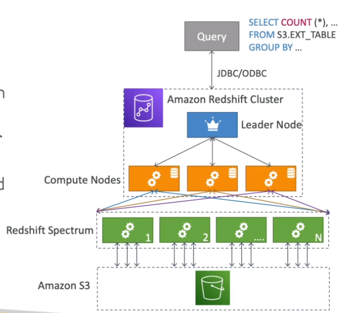

# AWS::Redshift::Cluster

- `Data Warehousing` solution
- `Online Analytical processing` (OLAP) based on PostgreSQL
- Petabytes of data
- `Columnar` data storage
- `Massively Parallel Query Execution` (MPP)
- SQL interface to perform queries
- Great integration with tools like `AWS Quicksight` and `Tableau`
- Faster than Athena thank to indexes

- **Redshift Spectrum**: Directly query from S3, no need to load

  ```sql
  SELECT count(*)
  FROM S3.EXT_TABLE
  GROUP BY ...
  ```

  

## AvailabilityZone

- Redshift runs in a `single AZ`
- You can configure `automatic copy snapshots` to another region, hence creating a data recovery strategy

## Endpoint

- Kinesis (through s3 copy)
- S3
- DynamoDB
- DMS
- EC2 instance
- ...

## EnhancedVpcRouting

- `COPY`/`UNLOAD` traffic goes through VPC
- Force traffic through `private network`
- For `security` concerns

## NodeType

- `Leader Node`: for planing queries and results aggregation
- `Compute Node`: for performing queries and send back to the leader

- Max `1 to 128 compute nodes`, `128TB` per node
