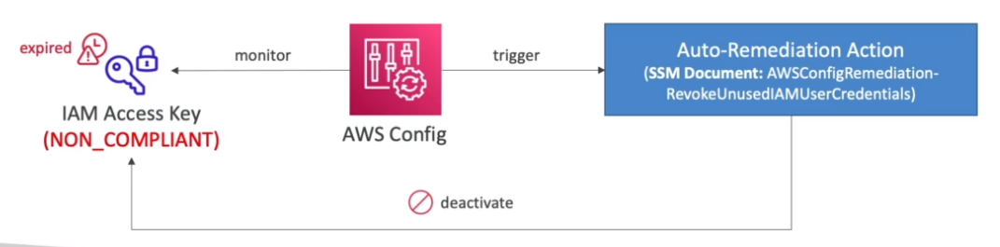
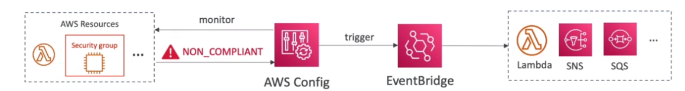

# AWS::AppConfig::ConfigurationProfile

- It's the target whose config is being monitored
- Enables AWS AppConfig to access the configuration source

- Record configuration and changes over time
- Can receive `alerts` based on the changes
- It tells if a resource is `compliant` or `noncompliant` but does not enforce policies
- The config changes are delivered to a `S3 bucket`

```yaml
Type: AWS::AppConfig::ConfigurationProfile
Properties:
  ApplicationId: String
  Description: String
  LocationUri: String
  Name: String
  RetrievalRoleArn: String
  Tags:
    - Tags
  Validators:
    - Validators
```

- **Rules**

  - `AWS managed` config rules
    - E.g., do not allow ssh open port on EC2 instance
  - `Custom` config rules
    - E.g., if each EBS disk is gp2, if each EC2 is t2.micro

- **Notifications**

  - E.g., notified via email when someone modified your EC2 instances' Security Group

- **Remediations**

  - `SSM Documents`: Take actions based on the config status (compliant or noncompliant)
    

  - `Event Bridge`: Trigger actions on resources that are noncompliant
    

  - `SNS Topic`
    - Send noncompliant resource changes to SNS
