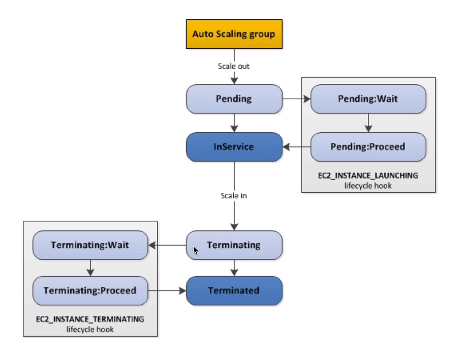

# AWS::AutoScaling::LifecycleHook

- Before a new scaled instance is `InService`, there might be some steps beforewards or afterwards
- You can put an instance that is in the `InService` state into the `Standby` state, update some software or troubleshoot the instance, and then return the instance to service

- Lifecycle hooks enable you to perform custom actions by pausing instances as an Auto Scaling group `launches` or `terminates` them
- When an instance is paused, it remains in a `wait state` either until you complete the lifecycle action using the `complete-lifecycle-action` command or the `CompleteLifecycleAction` operation
- For example, you could install or configure software on newly launched instances, or download log files from an instance before it terminates.

## LifecycleTransition

- `EC2_INSTANCE_LAUNCHING`
- `EC2_INSTANCE_TERMINATING`
