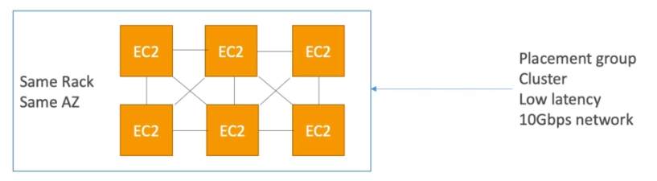
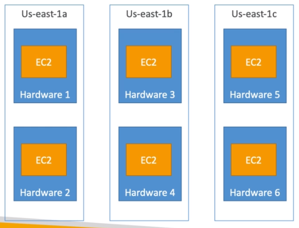
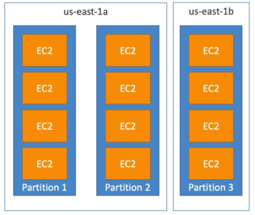

# AWS::EC2::PlacementGroup

- Set `where` ec2 instances will be `provisioned`
- Placements groups are created separately and associated with a EC2 instance at its creation

## Properties

- <https://docs.aws.amazon.com/AWSCloudFormation/latest/UserGuide/aws-resource-ec2-placementgroup.html>

```yaml
Type: AWS::EC2::PlacementGroup
Properties:
  PartitionCount: Integer
  SpreadLevel: String
  Strategy: String
  Tags:
    - Tag
```

### Strategy

- **cluster** (high performance): deploy to same rack (and same AZ). High performance + High risk. Good for HPC. 10 Gbps network



- **spread** (high availability): deploy to different racks (at most one instance per rack) across different AZ's (in the same region). Limited to 7 instances per AZ



- **partition** (balanced): deploy to the same rack (and same AZ), but they are replicated to other racks (and other AZs) as a backup. The number of partitions define the number of replicas. Use case for HDFS, HBase, Cassandra, Kafka


