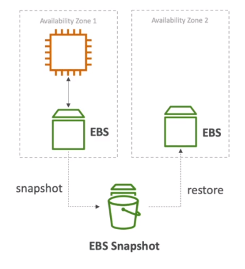

# AWS::EC2::Volume

- Specifies an `Elastic Block Store` (EBS)
- `Network drive` (not physical) that can be attached to instances on the fly
- EBS volume can be configured to `Delete on Termination`
- **Volume Behavior**
  - `Stop`: data on disk (EBS) is kept intact
  - `Terminate`: root EBS volumes is destroyed
  - `Hibernate`: RAM is dumped into a file in the encrypted EBS volume. Faster boot

## Properties

- <https://docs.aws.amazon.com/AWSCloudFormation/latest/UserGuide/aws-resource-ec2-volume.html>

```yaml
Type: AWS::EC2::Volume
Properties:
  AutoEnableIO: Boolean
  AvailabilityZone: String
  Encrypted: Boolean
  Iops: Integer
  KmsKeyId: String
  MultiAttachEnabled: Boolean
  OutpostArn: String
  Size: Integer
  SnapshotId: String
  Tags:
    - Tag
  Throughput: Integer
  VolumeType: String
```

### AvailabilityZone

- Belongs to an `AZ` and cannot be bound to ec2 instances in other AZ's. To attach the volume to an instance use `AWS::EC2::VolumeAttachment`

### Encrypted

- Encryption has minimal impact on latency
- To encryption a volume at later time, you can create a snapshot, copy & encrypt, and then restore it

### Iops

- `Capacity` and `IOPS` must be defined in advance

### MultiAttachEnabled

- If not enabled, the EBS volume can only be attached to one instance at a time

### VolumeType

- `General Purpose SSD` (gp2/gp3)
  - Can be used as boot volume
  - 1GiB - 16 TiB
- `Provisioned IOPS SSD` (io1/io2)
  - Can be used as boot volume
  - Low latency
  - For applications with more than 16k IOPS
  - Great for databases
  - Supports _multi-attach_ (within same AZ)
  - _io2 Block Express_ volume achieve maximum IOPS of 256k
- `Throughput Optimized HDD` (st1)
  - Max throughput 500MiB/s
- `Cold HDD` (sc1)
  - Lowest cost
  - Archive data
  - Max throughput 250MiB/s
- `Magnetic` (standard)
  - Can be used as boot volume

### SnapshotId

- Backup the EBS volume
- Snapshots can be `restored` to any AZ region (not only the original one)
- A new volume can be then created from a snapshot


