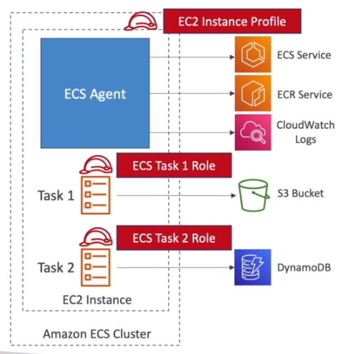
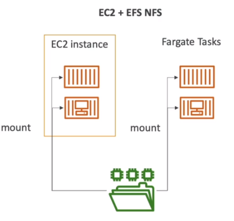

# AWS::ECS::TaskDefinition

- Describes the `container` and `volume` definitions

```yaml
Type: AWS::ECS::TaskDefinition
Properties:
  ContainerDefinitions:
    - ContainerDefinition
  Cpu: String
  EphemeralStorage: EphemeralStorage
  ExecutionRoleArn: String
  Family: String
  InferenceAccelerators:
    - InferenceAccelerator
  IpcMode: String
  Memory: String
  NetworkMode: String
  PidMode: String
  PlacementConstraints:
    - TaskDefinitionPlacementConstraint
  ProxyConfiguration: ProxyConfiguration
  RequiresCompatibilities:
    - String
  Tags:
    - Tag
  TaskRoleArn: String
  Volumes:
    - Volume
```

## ContainerDefinitions

```json
{
  "AWSEBDockerrunVersion": 2,
  "containerDefinitions": [
    {
      "name": "client",
      "image": "hvitoi/multi-client",
      "hostname": "client",
      "essential": false,
      "memory": 128
    },
    {
      "name": "server",
      "image": "hvitoi/multi-server",
      "hostname": "api",
      "essential": false,
      "memory": 128
    },
    {
      "name": "worker",
      "image": "hvitoi/multi-worker",
      "hostname": "worker",
      "essential": false,
      "memory": 128
    },
    {
      "name": "nginx",
      "image": "hvitoi/multi-nginx",
      "hostname": "nginx",
      "essential": true,
      "portMappings": [{ "hostPort": 80, "containerPort": 80 }],
      "links": ["client", "server"],
      "memory": 128
    }
  ]
}
```

## TaskRoleArn

- **EC2 Instance Profile** are attached to the `agent` in order to:

  - Call the `ECS Service` API
  - Pull images from `ECR Service`
  - Send logs to `CloudWatch`

- **ECS Task Role** are attached to the `task`
  - Allow each task to have a specific role
  - Task roles are defined in a `task definition`



## Volumes

- ECS has integration with `EFS`
- Multi-AZ shared storage
- The volumes are directly mounted into the container


