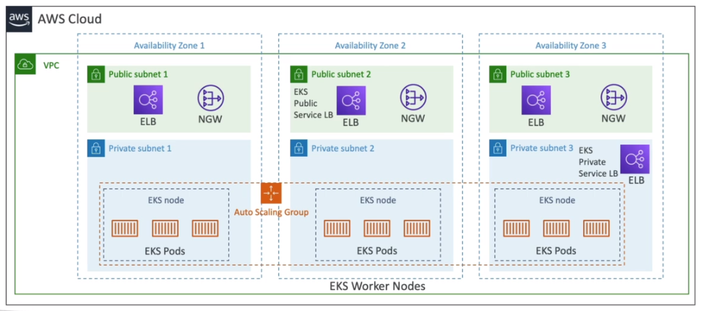

# AWS::EKS::Cluster

- `Elastic Kubernetes Service`
- Container orchestration
- It's an alternative to ECS (a better one btw)

- **Modes**
  - `EC2 Launch Mode`: you deploy the worker nodes yourself (with ec2 instances)
  - `Fargate Mode`: fully managed and serverless
