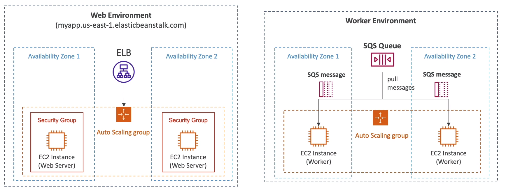

# AWS::ElasticBeanstalk::Environment

- AWS resources running a specific application version
- Supports multiple environments: dev, test, prod, etc

```yaml
Type: AWS::ElasticBeanstalk::Environment
Properties:
  ApplicationName: String
  CNAMEPrefix: String
  Description: String
  EnvironmentName: String
  OperationsRole: String
  OptionSettings:
    - OptionSetting
  PlatformArn: String
  SolutionStackName: String
  Tags:
    - Tag
  TemplateName: String
  Tier: Tier
  VersionLabel: String
```

## Tier



- `Web Environment`: clients access your server directly
- `Worker Environment`: server is accessed by internal components only. E.g., SQS
