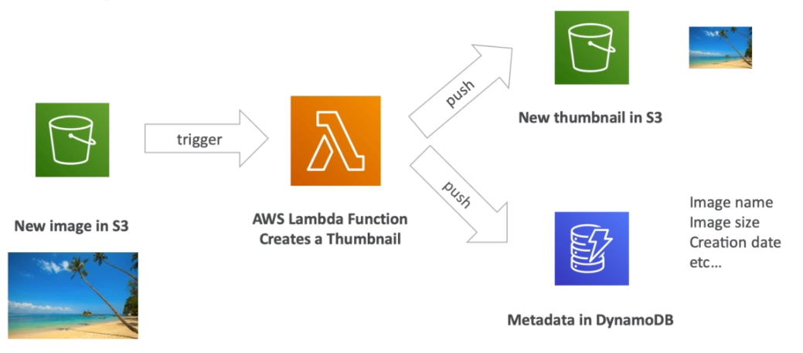
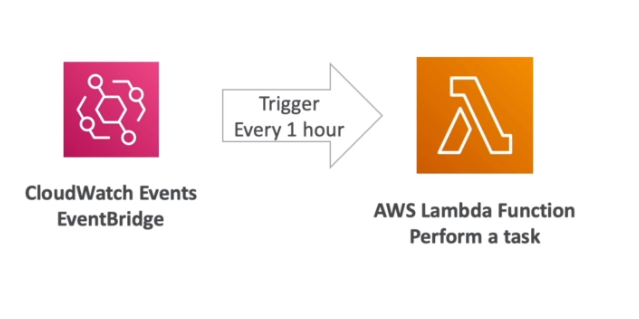

# AWS::Lambda::Function

- Serverless! No servers to manage
- Ideal to simple short executions
- Run `on demand` with `autoscaling`
- `Lambda Container Image`: it's an specify kind of container that is meant to be run on Lambda. It's different from the conventional docker image

- **Limits**

  - `Execution`
    - Memory: 128 MB - 10 GB
    - Max duration: 15 min
    - Environment variables: 4 KB
    - Disk capacity (/tmp): 512 MB
    - Concurrent executions: _1000_ (can be increased)
  - `Deployment`
    - Size (compressed .zip): 50 MB
    - Size (code + dependencies): 250 MB

- **Pricing**

  - `Pay per call`
    - First 1M is free
    - After that, $0.20 per 1M
  - `Pay per duration`
    - First 400000 seconds / month is free (for 1GB RAM)

- **Integrations**

  - API Gateway
  - Kineses
  - DynamoDB
  - S3
  - Cloudfront
  - CloudWatch Events
  - CloudWatch Logs
  - SNS
  - SQS
  - Cognito

- **Use cases**

  - Thumbnail creation

  

  - Serverless cronjob

  

```yaml
Type: AWS::Lambda::Function
Properties:
  Architectures:
    - String
  Code: Code
  CodeSigningConfigArn: String
  DeadLetterConfig: DeadLetterConfig
  Description: String
  Environment: Environment
  FileSystemConfigs:
    - FileSystemConfig
  FunctionName: String
  Handler: String
  ImageConfig: ImageConfig
  KmsKeyArn: String
  Layers:
    - String
  MemorySize: Integer
  PackageType: String
  ReservedConcurrentExecutions: Integer
  Role: String
  Runtime: String
  Tags:
    - Tag
  Timeout: Integer
  TracingConfig: TracingConfig
  VpcConfig: VpcConfig
```

## Code

```python
import json

def lambda_handler(event, context):
    body = "Hello from Lambda!"
    statusCode = 200
    return {
        "statusCode": statusCode,
        "body": json.dumps(body),
        "headers": {
            "Content-Type": "application/json"
        }
    }
```

## Role

- By default, lambda functions has a `role` with policy able to write to `CloudWatch`

## Runtime

- Node.js
- Python
- Java
- C#
- Golang
- Ruby
- Custom Runtime API (enables any language, e.g., Rust)
