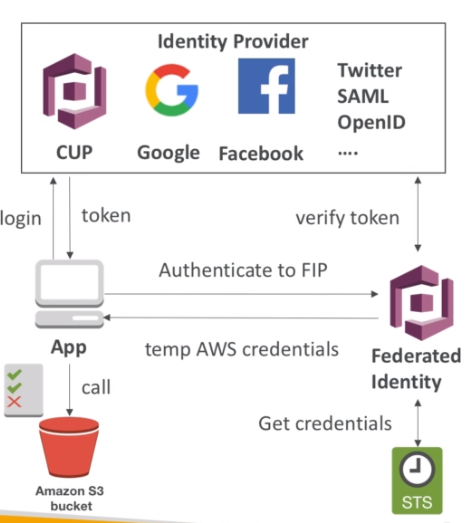

# AWS::Cognito::IdentityPool

- Creates an `identity pool` (Federated Identities)
- Takes all your identity providers and puts them together (federates them)
- With the `Federated Identities` the users are managed externally

- Let external users assume `temporary roles` for accessing AWS resources by means of `STS`



```yaml
Type: AWS::Cognito::IdentityPool
Properties:
  AllowClassicFlow: Boolean
  AllowUnauthenticatedIdentities: Boolean
  CognitoEvents: Json
  CognitoIdentityProviders:
    - CognitoIdentityProvider
  CognitoStreams: CognitoStreams
  DeveloperProviderName: String
  IdentityPoolName: String
  OpenIdConnectProviderARNs:
    - String
  PushSync: PushSync
  SamlProviderARNs:
    - String
  SupportedLoginProviders: Json
```

## CognitoIdentityProviders

- _SAML 2.0_: the client exchange a saml token for an sts token
- _Custom Identity Broker_: the IdP talks directly to the sts and give the token to the user
- _Web Identity Federation_: login on fb, google, etc
- _SSO_
- _AD_: database of objects (users, files, printers, etc)
