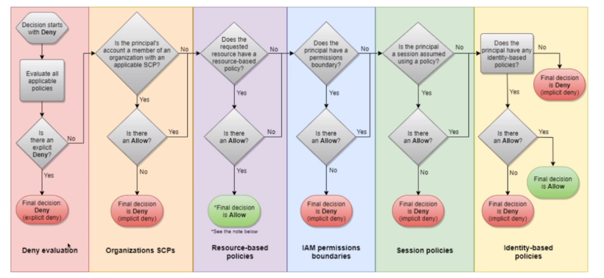

# AWS::IAM::ManagedPolicy

- `Permission Policy` is a JSON document that define a set permissions for making requests to AWS services
- Policies can be applied to `Users`, `Groups` and `Roles`
- There is a policy called `AdministratorAccess` that provides full access to AWS services and resources

```yaml
Type: AWS::IAM::ManagedPolicy
Properties:
  Description: String
  Groups:
    - String
  ManagedPolicyName: String
  Path: String
  PolicyDocument: Json
  Roles:
    - String
  Users:
    - String
```

- IAM is a global service
- `Root account` is created by default (though it's not good to use it directly)
- An account alias can be created in order to access the account (with any IAM user) from custom URI. <https://hvitoi.signin.aws.amazon.com/console>
- Access to Billing Information is not granted, even with administrator policy. For that, special config must be set up
- `Password policies` can be set for all users under `Account Settings`

- **Policy Evaluation Logic**
  

- **Access Analyzer**
  - `IAM Credentials Report` (account-level):report of all users and their statuses
  - `IAM Access Advisor` (user-level): show services accessed by a user in a time period

## PolicyDocument

- Most of the policies are `AWS managed`
- But you can also create your own policy
- Always use the `grant least privilege` principle

- <https://awspolicygen.s3.amazonaws.com/policygen.html>
- <https://policysim.aws.amazon.com/>

```json
// Alllow GET and LIST to S3 "my-bucket" when the user is root
{
  "Version": "2012-10-17",
  "Id": "S3-Read-Access", // optional
  "Statement": [
    {
      "Sid": "MyCustomStatement", // identifier (optional)
      "Effect": "Allow",
      "Action": ["s3:Get*", "s3:List*"],
      "Resource": "arn:aws:s3:::my-bucket/*", // S3 Object Level Permission (all files)
      "Principal": {
        "AWS": ["arn:aws:iam::123456789012:root"] // account/user/role this policies applies to
      },
      "Condition":
        // when this policy is in effect
        {
          "StringEquals": {
            "aws:RequestedRegion": ["eu-central-1", "eu-west-1"],
            "ec2:ResourceTag/Project": "DataAnalytics",
            "aws:PrincipalTag/Department": "Data"
          },
          "BoolIfExists": {
            "aws:MultiFactorAuthPresent": false
          },
          "NotIpAddress": {
            "aws:SourceIp": ["192.0.2.0/24", "203.0.113.0/24"]
          }
        }
    }
  ]
}
```
