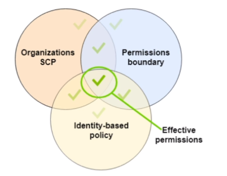

# AWS::IAM::Role

- `Role` is an identity intended to be used by another aws service (trusted entity - E.g., ec2, s3)

```yaml
Type: AWS::IAM::Role
Properties:
  AssumeRolePolicyDocument: Json
  Description: String
  ManagedPolicyArns:
    - String
  MaxSessionDuration: Integer
  Path: String
  PermissionsBoundary: String
  Policies:
    - Policy
  RoleName: String
  Tags:
    - Tag
```

## AssumeRolePolicyDocument

- **Security Token Service** (STS)

- Generate token with `limited` and `temporary` access to AWS resources
- Token is valid up to `1 hour`, must be `refreshed` after this
- `Identity Providers` (IdP) can be used to authenticate with AWS (by means of STS)

- Identity Providers (`IdP`)

  - _SAML 2.0_: the client exchange a saml token for an sts token
  - _Custom Identity Broker_: the IdP talks directly to the sts and give the token to the user
  - _Web Identity Federation_: login on fb, google, etc (not recommended! Use Cognito instead)
  - _SSO_
  - _AD_: database of objects (users, files, printers, etc)

- APIs

  - **AssumeRole API**
    - User will use a role within your account or cross-account

  

  - **AssumeRoleWithSaml API**: return credentials for users logged in SAML
  - **AssumeRoleWitWebIdentity API**: returns credentials for users logged with IdP (fb, google, etc)
  - **GetSessionToken API**: for MFA

## PermissionsBoundary

- Supported for `users` and `roles` (not groups)
- Define the maximum permissions an entity can get
- `Permission boundary` (maximum scope) + `permission policies`



- Use cases
  - Deletate responsabilities to non administrators within their permissions boundaries
  - Allow self-assign policies and manage their own permissions
