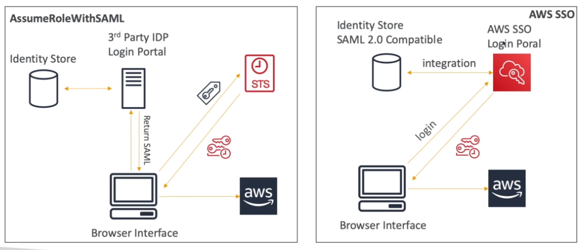

# AWS::SSO::Assignment

- Log once and have access to multiple accounts
- Supports SAML 2.0 markup
- Integration with `AD`
- Centralized auditing with Cloudtrail
- Allow access to multiple account at once

- **SSO vs. AssumeRoleWithSAML**

