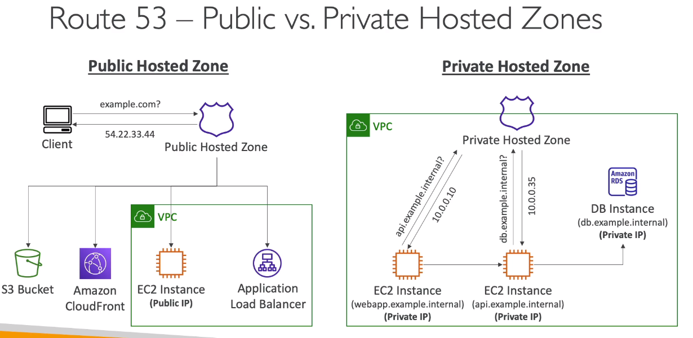

# AWS::Route53::HostedZone

- A container for the records
- Define how to traffic to a domain a subdomains
- `$0.50` per month per hosted zone on Route 53
- `Public Hosted Zone`: how to route traffic on the internet
- `Private hosted Zone`: how to route traffic within one or more PVCs (private domain names)



- In order to use `private hosted zone`, the VPC must:
  - `enableDnsSupport` set to true
  - `enableDnsHostname` set to true
- A private hosted zone is accessible within a VPC

```yaml
Type: AWS::Route53::HostedZone
Properties:
  HostedZoneConfig: HostedZoneConfig
  HostedZoneTags:
    - HostedZoneTag
  Name: String
  QueryLoggingConfig: QueryLoggingConfig
  VPCs:
    - VPC
```

- **Authoritative DNS Server**

  - A DNS Server where the customer (you) can modify the DNS records
  - Route53 is both an `authoritative DNS server` and a `domain registrar`

- **Register Domain**

  - Route 53 can be used to register a domain with anual payment
  - Once the domain is registered in Route 53, it is automatically added to a hosted zone
  - You can also register it somewhere else (e.g. godaddy) and create a hosted zone for it in Route 53 manually
