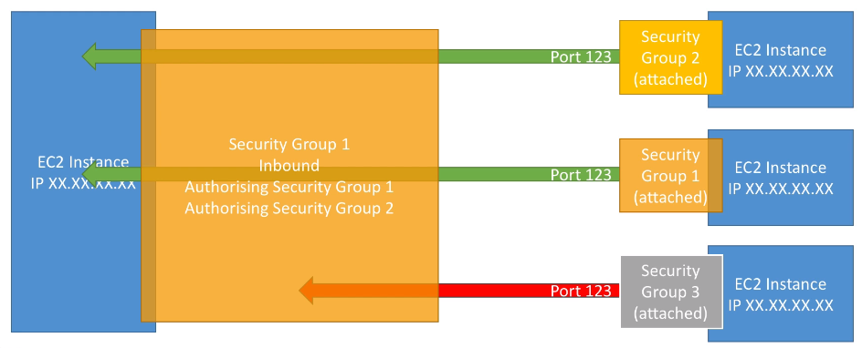

# AWS::EC2::SecurityGroup

- A `security group` is a set of firewall rules that control the traffic for your instance
- It's attached to an ENI
- **Rules** can be added to allow specific traffic to reach your instance
  - Rules are `allow only`
  - `Type`: protocol to be allowed
  - `Port range`: ports to allow. 0.0.0.0/0 (anywhere ipv4), ::/0 (anywhere ipv6)
  - `Source`: source IP
  - `Traffic way`: Inbound or Outbound
- One Security group can be attached to multiple ec2 instances and one ec2 instance can have multiple securities groups
- Security groups are locked down to a region/vpc combination
- By `default` all inbound traffic is blocked and all outbound traffic is authorized
- Security groups can reference other security groups

- Common ports
  - 22 (SSH)
  - 21 (FTP)
  - 22 (SFTP)
  - 80 (HTTP)
  - 443 (HTTPS)
  - 3389 (RDP)
