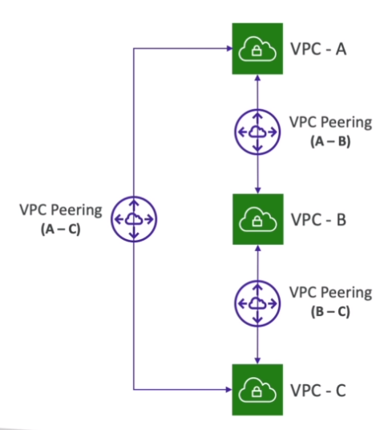

# AWS::EC2::VPCPeeringConnection

- Connect `2 VPCs` privately (within region, cross regions or cross accounts)
- Cannot have overlapping CIDRs
- One VPC `requests` the peer connection and the other vpc `accepts` the peer connection
- `Route table` (of both VPCs) must be updated in order to redirect traffic to the `peering connection`

