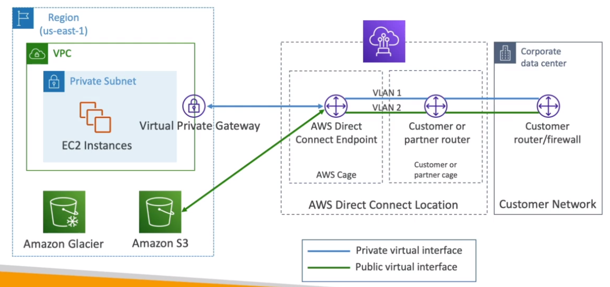
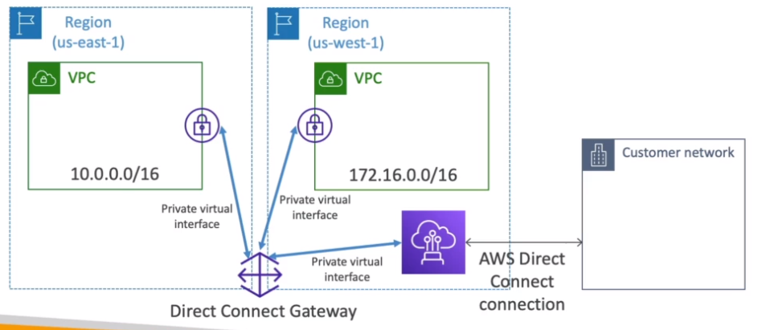
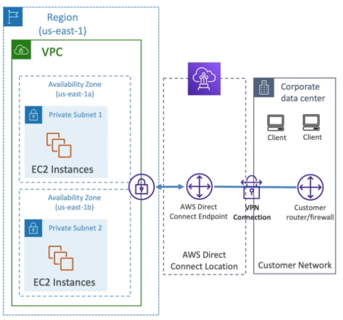
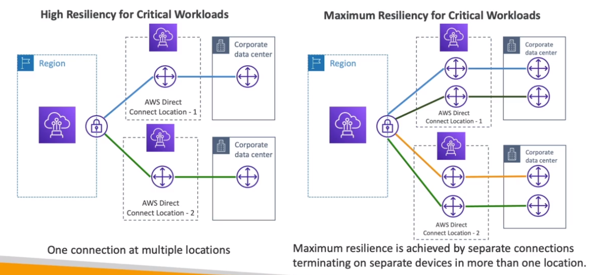

# Direct Connect (DX)

- Provides `private connection` from remote network to your VPC (differently from VPN which goes through internet)
- Connection is established between your `Corporate Data Center` and `AWS Direct Connect Locations`
- For that a `VGW` is needed on the VPC
- Offers a high throughput

## Direct Connect Gateway

- Connect `VPCs` in different regions to `Direct Connection Location`

## Connection Types

- `Dedicated Connection`
  - 1 Gbps and 10 Gbps
- `Hosted Connection`
  - 50 Mbps, 500 Mbps, ..., 10 Gbps
  - Add/remove capacity on demand
  - Lead time to establish the connection longer than 1 month

## Encryption

- Data in transit is not encrypted (but it's in a private net)
- But a VPN connection can be established between Direct Connection Location and the Customer Network to encrpt the data

## Resiliency

