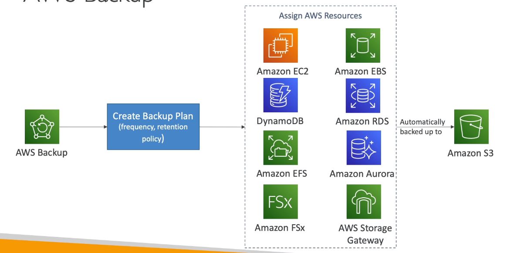

# AWS::Backup::BackupPlan

- `Centrally` manage `backups` across AWS services
- No custom scripts or manual processes
- Supported Services
  - FSx
  - EFS
  - DynamoDB
  - EC2
  - EBS
  - RDS (including aurora)
  - Storage Gateway (volume gateway)
- Support `cross-region` and `cross-account` backups



```yaml
Type: AWS::Backup::BackupPlan
Properties:
  BackupPlan: BackupPlanResourceType
  BackupPlanTags:
    Key: Value
```

## BackupPlan

- Backup `frequency`
- Backup `window`
- Transition to `cold storage`
- `Retention period`
- Backup based on tags
