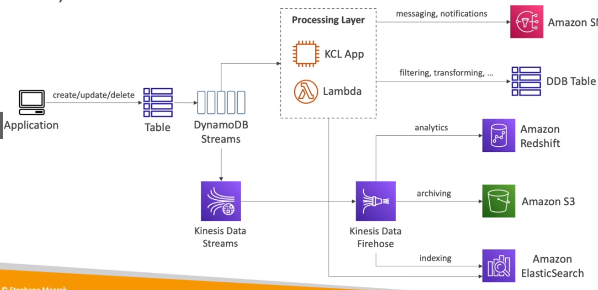

# AWS::DynamoDB::Table

- Serverless `NoSQL database`
- Multi-AZ
- Integration with IAM for authentication & authorization

- DynamoDB is made of `Tables` (Collection)
- Each table can have infinite number of `Items` (Document). With maximum size of 400KB
- Each item has `Attributes` (Field)

```yaml
Type: AWS::DynamoDB::Table
Properties:
  AttributeDefinitions:
    - AttributeDefinition
  BillingMode: String
  ContributorInsightsSpecification: ContributorInsightsSpecification
  GlobalSecondaryIndexes:
    - GlobalSecondaryIndex
  KeySchema:
    - KeySchema
  KinesisStreamSpecification: KinesisStreamSpecification
  LocalSecondaryIndexes:
    - LocalSecondaryIndex
  PointInTimeRecoverySpecification: PointInTimeRecoverySpecification
  ProvisionedThroughput: ProvisionedThroughput
  SSESpecification: SSESpecification
  StreamSpecification: StreamSpecification
  TableClass: String
  TableName: String
  Tags:
    - Tag
  TimeToLiveSpecification: TimeToLiveSpecification
```

- **Transactions**
  - Write to two tables at the same time or none=
    

## KeySchema

- Each table has `Partition Key` (hash) and a `Sort Key` (range) (optional)
- The combination of both is the `Primary Key`
- Here are defined the partition keys and sort keys

## GlobalSecondaryIndexes

- GSI is an index with a `partition key` (hash) and a `sort key` (range)
- Allows search across partitions

- Allows `query on attributes` other than on the Primary Key


## LocalSecondaryIndexes

- LSI is an index with same `partition key` (hash), but different `sort key` (range)
- Allows search within the same partition

## AttributeDefinitions

- Define all the attributes that are going to be used for query
- Each attribute defined here must be either in KeySchema or GlobalSecondaryIndexes
- Attribute created on-the-fly cannot be used for searching

- **Data types**
  - `Scalar Types`: String, Number, Binary, Boolean, Null
  - `Document Types`: List, Map
  - `Set Types`: String Set, Number Set, Binary Set

```json
{
  "my-string": {
    "S": "aa"
  },
  "my-number": {
    "N": "0"
  },
  "my-boolean": {
    "BOOL": false
  },
  "my-binary": {
    "B": ""
  },
  "my-null": {
    "NULL": true
  },
  "my-string-set": {
    "SS": ["aa", "bb", "cc"]
  },
  "my-number-set": {
    "NS": ["0", "1", "2"]
  },
  "my-binary-set": {
    "BS": ["", ""]
  },
  "my-list": {
    "L": [
      {
        "S": "aa"
      },
      {
        "N": "0"
      }
    ]
  },
  "my-map": {
    "M": {
      "key1": {
        "S": "aa"
      },
      "key2": {
        "N": "0"
      }
    }
  }
}
```

## BillingMode

- It's how to control the table's `capacity` (read/write throughput)

  - `Provisioned Mode` (default)
    - Specified beforehand
    - Autoscaling can be configured
    - RCU (read capacity unit)
    - WCU (write capacity unit)
  - `On-Demand Mode`
    - Scales automatically based on the workload
    - More expensive!
    - Useful for very unpredictable workloads

## StreamSpecification

- `DynamoDB Streams` offers an ordered stream of modifications in a table (create, update, delete, ...)
- Streams can be sent to
  - Kinesis Data Streams
  - AWS Lambda
  - Kinesis Client Library applications
- Data retention `up to 24 hours`
- Use cases:
  - React to changes in real-time (e.g., welcome new users)
  - Analytics
  - Insert into derivative tables
  - Insert into elasticsearch
  - Implement cross-region replication



## TimeToLiveSpecification

- Automatically expire an item using its `timestamp` attribute (`ExpTime`)
