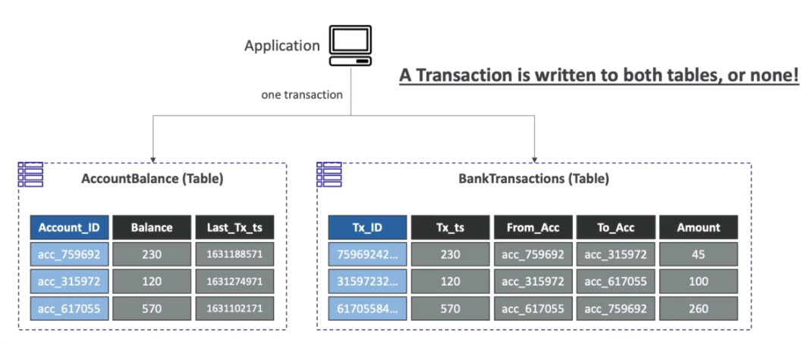
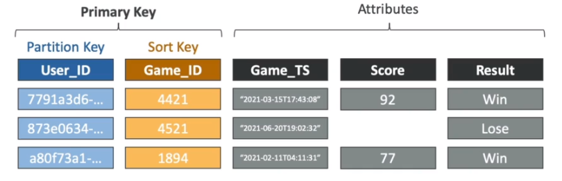

# AWS::DynamoDB::Table

- Serverless `NoSQL database`
- Multi-AZ
- Integration with IAM for authentication & authorization

- Structure
  - DynamoDB is made of `Tables` (Collection)
  - Each table can have infinite number of `Items` (Document). With maximum size of 400KB
  - Each item has `Attributes` (Field)

```yaml
Type: AWS::DynamoDB::Table
Properties:
  AttributeDefinitions:
    - AttributeDefinition
  BillingMode: String
  ContributorInsightsSpecification: ContributorInsightsSpecification
  GlobalSecondaryIndexes:
    - GlobalSecondaryIndex
  KeySchema:
    - KeySchema
  KinesisStreamSpecification: KinesisStreamSpecification
  LocalSecondaryIndexes:
    - LocalSecondaryIndex
  PointInTimeRecoverySpecification: PointInTimeRecoverySpecification
  ProvisionedThroughput: ProvisionedThroughput
  SSESpecification: SSESpecification
  StreamSpecification: StreamSpecification
  TableClass: String
  TableName: String
  Tags:
    - Tag
  TimeToLiveSpecification: TimeToLiveSpecification
```

- **Transactions**
  - Write to two tables at the same time or none=
    

## KeySchema

- Each table has `Partition Key` (hash) and an optional `Sort Key` (range)
- Partition Key
  - It's used as input to the hashing function
  - The output of the hashing function will tell to which physical partition the item will go
  - Same partition key goes to same partition (similar to kafka)
  - This speeds the lookup, given that with the partition key it's possible to know in which partition the data is stored
- Sort key
  - It's used to tell where dynamo will store the data inside of the partition
  - This way, the values for the same partition key can be sorted physically on the partition
- The combination of both is the `Primary Key`
- Here are defined the partition keys and sort keys

## GlobalSecondaryIndexes

- Creating a GSI clones the table using a new partition key (`GSI Partition Key`) and optionally a new sort key (`LSI Sort Key`)
  - The main table and the GSI tables are kept in-sync
  - The original partition key becomes a conventional attribute in the GSI Table
- On the `GSI table` you can then `query on attributes` (the GSI partition key) that is not partition key or sort key
  - More efficient! Avoids scanning the whole table
- The RCU / WCU is defined separately for the `GSI table`
- Allows search across partitions
- Writes the Main Table leads to writes to GSI, which doubles the cost of writing
  - Use the WCU for the GSI equal to the WCU of the main table!
- There we be an inconsistency between the main table and the GSI while it's being sync (`eventual consistency`)
- You can have up to `20 GSIs`



## LocalSecondaryIndexes

- LSI add a new "sort key" (the `LSI Sort Key`)
- This way, you can fetch the item directly using the partition key + the LSI sort key
- Allows search within the same partition (or same partition key)
- You can have up to `5 LSIs`
- Can only be defined at table creation time
- No extra cost! (this doesn't clone the table like GSI does)

## AttributeDefinitions

- Define all the attributes that are going to be used for query
- Each attribute defined here must be either in KeySchema or GlobalSecondaryIndexes
- Attribute created on-the-fly cannot be used for searching

- **Data types**
  - `Scalar Types`: String, Number, Binary, Boolean, Null
  - `Document Types`: List, Map
  - `Set Types`: String Set, Number Set, Binary Set

```json
{
  "my-string": {
    "S": "aa"
  },
  "my-number": {
    "N": "0"
  },
  "my-boolean": {
    "BOOL": false
  },
  "my-binary": {
    "B": ""
  },
  "my-null": {
    "NULL": true
  },
  "my-string-set": {
    "SS": ["aa", "bb", "cc"]
  },
  "my-number-set": {
    "NS": ["0", "1", "2"]
  },
  "my-binary-set": {
    "BS": ["", ""]
  },
  "my-list": {
    "L": [
      {
        "S": "aa"
      },
      {
        "N": "0"
      }
    ]
  },
  "my-map": {
    "M": {
      "key1": {
        "S": "aa"
      },
      "key2": {
        "N": "0"
      }
    }
  }
}
```

## BillingMode

- It's how to control the table's `capacity` (read/write throughput)

  - **Provisioned Mode** (default)
    - Specified beforehand
    - Autoscaling can be configured
    - RCU (read capacity unit)
    - WCU (write capacity unit)
    - The total capacity unit (read or write) is shared (splitted equally) for all partitions
    - Therefore it's important the spread the data evenly across the partitions
    - `Adaptive capacity` can also be used. With that, a hot partition can borrow capacity from another idler partition
    - If the capacity is exceeded (throttling) dynamo will reject the request
    - There is a hard limit of `3000 RCU` and `1000 WCU` per partition, if you need to go over it you need to use DAX (caching layer)
  - **On-Demand Mode**
    - Scales automatically based on the workload
    - More expensive!
    - Useful for very unpredictable workloads

## StreamSpecification

- `DynamoDB Streams` offers an ordered stream of modifications in a table (create, update, delete, ...)
- Capture item-level changes in the table and push the changes to DynamoDB streams
- The change can be accessed through `DynamoDB Streams API`
- Streams can be sent to
  - Kinesis Data Streams
  - AWS Lambda
  - Kinesis Client Library applications
- Data retention `up to 24 hours`
- Use cases:
  - React to changes in real-time (e.g., welcome new users)
  - Analytics
  - Insert into derivative tables
  - Insert into elasticsearch
  - Implement cross-region replication


## TimeToLiveSpecification

- Automatically expire an item using its `timestamp` attribute (`ExpTime`)
- The deletion is not immediate. It can take up to 48 hours

## PointInTimeRecoverySpecification

- Snapshots of the table that allows reverting back to a specific point in time
