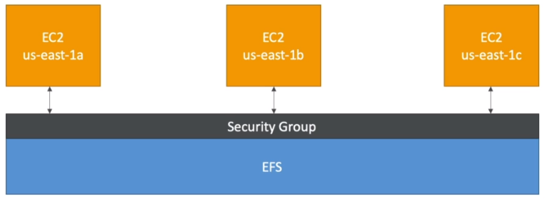

# AWS::EFS::FileSystem

- Managed `NFS` (network file system)
- Works with ec2 instances in `multiple AZs`
- Compatible with `Linux` (posix fs) only!
- Differently from EBS, it allows multi-attach from multiple AZs at same time
- EFS drives are attached to the `ENI` of the respective EC2 instance
- Pay per use. No capacity planning

- **Access**
  - `Security group` attached to the EFS is used to control access
  - The SG (for the EFS) must have `inbound rule` TCP 2049 from ec2 instances ip (or ec2 sg)
    
  - `EFS Access Points` can be used to manage application access

- **Capacity**
  - `1000s` concurrent clients, `10GiB/s` throughput
  - Grow to `Petabyte`-scale automatically

## Properties

- <https://docs.aws.amazon.com/AWSCloudFormation/latest/UserGuide/aws-resource-efs-filesystem.html>

```yaml
Type: AWS::EFS::FileSystem
Properties:
  AvailabilityZoneName: String
  BackupPolicy:
    BackupPolicy
  BypassPolicyLockoutSafetyCheck: Boolean
  Encrypted: Boolean
  FileSystemPolicy: Json
  FileSystemProtection:
    FileSystemProtection
  FileSystemTags:
    - ElasticFileSystemTag
  KmsKeyId: String
  LifecyclePolicies:
    - LifecyclePolicy
  PerformanceMode: String
  ProvisionedThroughputInMibps: Number
  ReplicationConfiguration:
    ReplicationConfiguration
  ThroughputMode: String
```

### Encrypted

- Encryption at rest using `KMS`

### LifecyclePolicies

- **Storage Tier**
  - `Standard`: frequent access
  - `Infrequent (EFS-IA)`: cost to access, lower price to store
  - Lifecycle management can be enabled in order to automatically transit between tiers

### PerformanceMode

- `General purpose` (default): for low latency (e.g., web server, wordpress)
- `Max I/O`: higher latency, high throughput, highly parallel (e.g., big data)

### ThroughputMode

- `Bursting` (default): throughput scales with fs size
- `Provisioned`: throughput fixed
