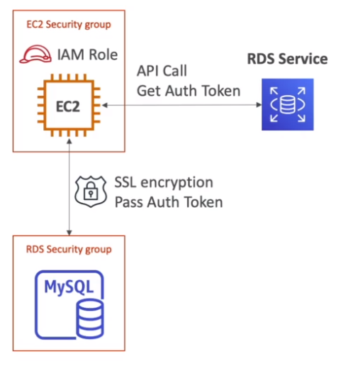
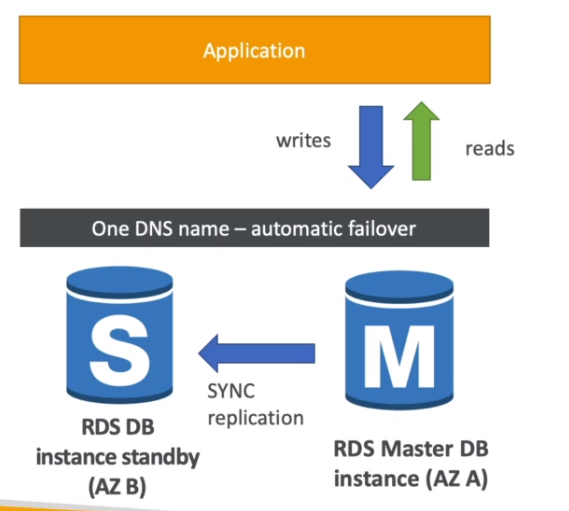
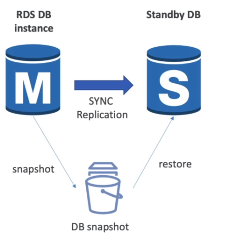
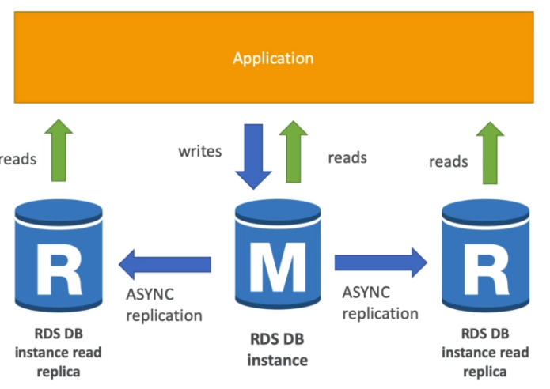
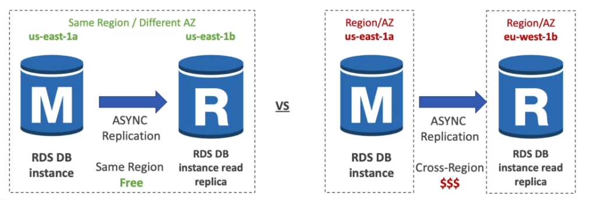
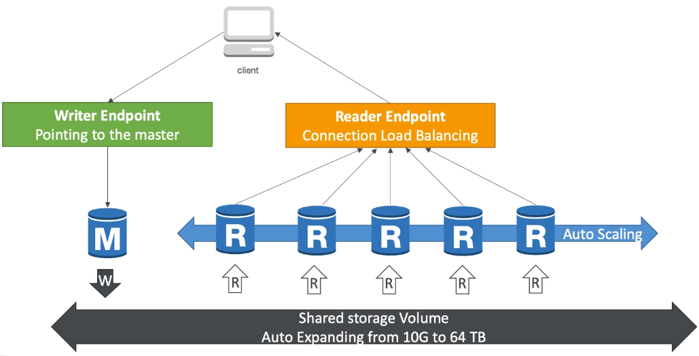
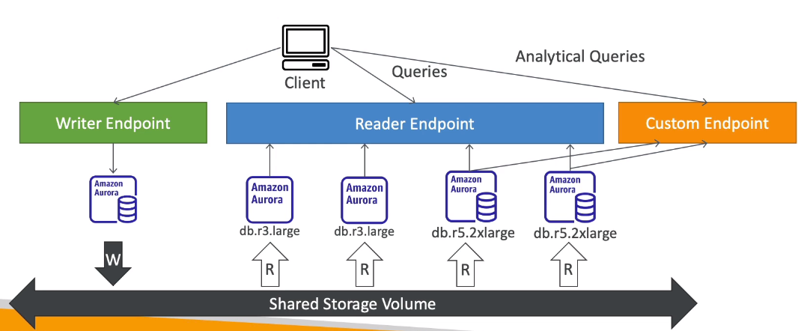
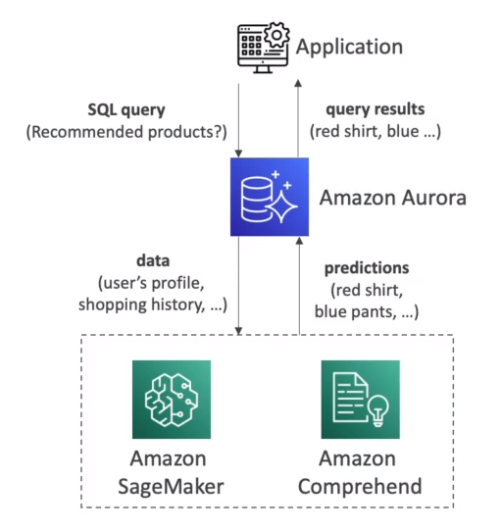

# AWS::RDS::DBInstance

- Managed underlying OS, updates, etc
- Continuous backups. Easily restore
- Monitoring dashboards
- Read replicas
- Multi-AZ for disaster recovery
- Maintenance windows for upgrades
- Scaling capability (vertical and horizontal)
- Storage backed by EBS (gp2 or io1)

```yaml
Type: AWS::RDS::DBInstance
Properties:
  AllocatedStorage: String
  AllowMajorVersionUpgrade: Boolean
  AssociatedRoles:
    - DBInstanceRole
  AutoMinorVersionUpgrade: Boolean
  AvailabilityZone: String
  BackupRetentionPeriod: Integer
  CACertificateIdentifier: String
  CharacterSetName: String
  CopyTagsToSnapshot: Boolean
  DBClusterIdentifier: String
  DBInstanceClass: String
  DBInstanceIdentifier: String
  DBName: String
  DBParameterGroupName: String
  DBSecurityGroups:
    - String
  DBSnapshotIdentifier: String
  DBSubnetGroupName: String
  DeleteAutomatedBackups: Boolean
  DeletionProtection: Boolean
  Domain: String
  DomainIAMRoleName: String
  EnableCloudwatchLogsExports:
    - String
  EnableIAMDatabaseAuthentication: Boolean
  EnablePerformanceInsights: Boolean
  Engine: String
  EngineVersion: String
  Iops: Integer
  KmsKeyId: String
  LicenseModel: String
  MasterUsername: String
  MasterUserPassword: String
  MaxAllocatedStorage: Integer
  MonitoringInterval: Integer
  MonitoringRoleArn: String
  MultiAZ: Boolean
  OptionGroupName: String
  PerformanceInsightsKMSKeyId: String
  PerformanceInsightsRetentionPeriod: Integer
  Port: String
  PreferredBackupWindow: String
  PreferredMaintenanceWindow: String
  ProcessorFeatures:
    - ProcessorFeature
  PromotionTier: Integer
  PubliclyAccessible: Boolean
  SourceDBInstanceIdentifier: String
  SourceRegion: String
  StorageEncrypted: Boolean
  StorageType: String
  Tags:
    - Tag
  Timezone: String
  UseDefaultProcessorFeatures: Boolean
  VPCSecurityGroups:
    - String
```

## BackupRetentionPeriod

- Daily `full backup` of the database (during the maintenance window)
  - `7 days` retention by default (can be increased to up to 35 days)
- `Transation logs` are backed-up every 5min
- Ability to restore to `any point in time`! (from the oldest backup to 5 minutes ago)

## EnableIAMDatabaseAuthentication

- IAM policies control who can manage RDS
- For authentication `user+pass` or `iam-auth` can be used
- IAM authentication can be used for mysql or postgres only (with a 15min token)



## Engine

- `Postgres`
- `MySQL`
- `MariaDB`
- `Oracle`
- `Microsoft SQL Server`
- `Aurora` (AWS proprietary db)

- **Aurora**
  - Proprietary database technology (AWS-owned)
  - Compatible with Postgres and MySQL drivers
  - Cloud optimized (`5x performance` over MySQL)
  - `Shared Storage Volume` that grows automatically up to 128TB (at 10GB steps)
  - 20% more expensive

## DBInstanceClass

- Standard
- Memory Optimized
- Burstable

## DBSnapshotIdentifier

- **Snapshots** are manually triggered by the user
- The retention is for as long as you want
- Restoring a snapshot is much quicker than creating a db and inserting everything you need

## MaxAllocatedStorage

- `Autoscaling` automatically increase the maximum size based on a `threshold` (e.g., free storage is less than 10% of total)
- `Maximmum Storage Threshold` must also be set to prevent scaling infinitely

## MultiAZ

- For **Disaster Recovery**
- `Sync` operation
- The data is synced to a standby replica
- This standby replica will be automatically used in case of failure of the main database (`failover`). Increased availability
- The standby db is not used for scaling
- A read replica can also be used as a failover!




## SourceDBInstanceIdentifier

- **Read Replicas**

- `Async` operation. Therefore is data is eventually consistent
- Up to `5 read replicas`
- Within an AZ, Cross-AZ or Cross-Region



- A replica can be promoted to be the main database

- Only attach applications to the main instance if really necessary!
- The application must update the connection string to include the read replicas
- There is a network cost over the `data replication` across AZs in `different regions`. Within the same region the replication is free



## StorageEncrypted

- **At rest encryption**

  - Master & read replicas (AWS KMS - AES-256)
  - If master is not encrypted, read replicas cannot be encrypted

- **In-flight encryption**

  - SSL certificates to encrypt data in transit
  - A trust certificate must be set up in order to connect to the db
  - To enforce SSL
    - Postgres: `rds.force_ssl=1` in AWS RDS console
    - MySQL: `GRANT USAGE ON *.* TO 'mysqluser'@'%' REQUIRE SSL`

- To encrypt an unencrypted RDS database:
  - Create a unencrypted snapshot
  - Copy the snapshot and enable encryption
  - Restore the db from the encrypted snapshot
  - Migrate applications to the new db

## Aurora

- Proprietary database technology (AWS-owned)
- Compatible with Postgres and MySQL drivers
- Cloud optimized (`5x performance` over MySQL)
- `Shared Storage Volume` that grows automatically up to 128TB (at 10GB steps)
- 20% more expensive

### Write modes

- `One writer + Multiple readers`
- `One writer + Multiple readers` (parallel query)
- `Multiple writers`
- `Serverless`: pay per usage only!

### Replication & Disaster Recovery

- Master (write) + `Up to 15 Read replicas` with faster sync
- Automatic `failover`. Failover is immediate if **multi-master** is enabled

- `Cross Region Replication`: useful for disaster recovery
- `Aurora Global Database`

  - 1 Primary Region (RW)
  - 5 Secondary Regions (RO) - with up to 15 replicas in each
  - Less than 1 second lag
  - RTO (`recovery time objective`) of 1 min. For disaster recovery

- **Priority Tier**

  - Each `Read Replica` is associated with a `priority tier` (0-15)
  - In the event of a failover, the Read Replica that has the highest priority will be promoted
  - If two or more Replicas share the same priority, the replica with largest size is used

### Endpoints & Autoscaling

- There is a `writer endpoint` and `reader endpoint` (load balanced)
- The read replicas can be `auto-scaled` and accessed through a `proxy fleet`



- Some read instances can also be configured with a custom endpoint (e.g., for special analytical queries)
- It's a good practice to define many custom endpoints for different workload types (query only a `subset` of the instances)



### Machine Learning

- ML-based predictions using SQL language
- Services
  - `Amazon SageMaker`: any model
  - `Amazon Comprehend`: sentiment analysis
- Use cases
  - Fraud detection
  - Ads targeting
  - Sentiment analysis
  - Product recommendations


