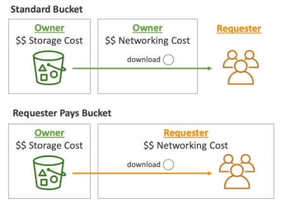
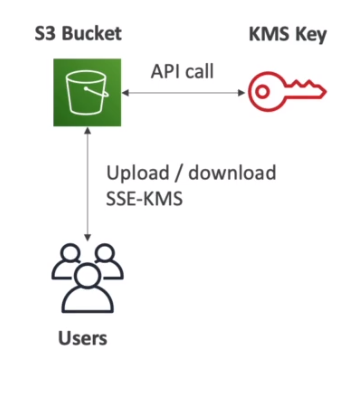
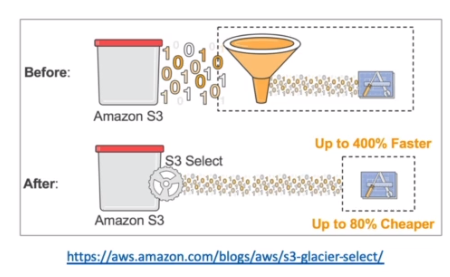
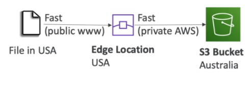
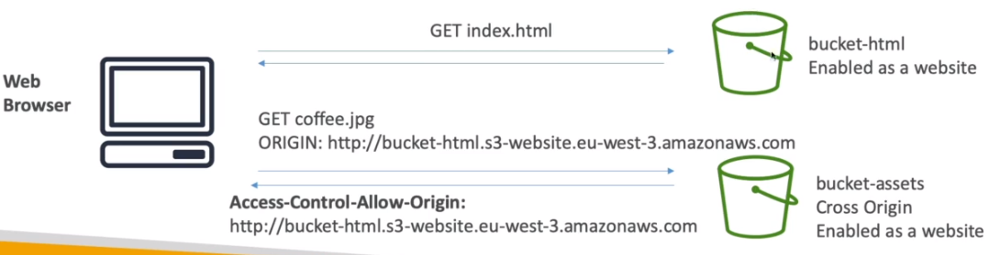
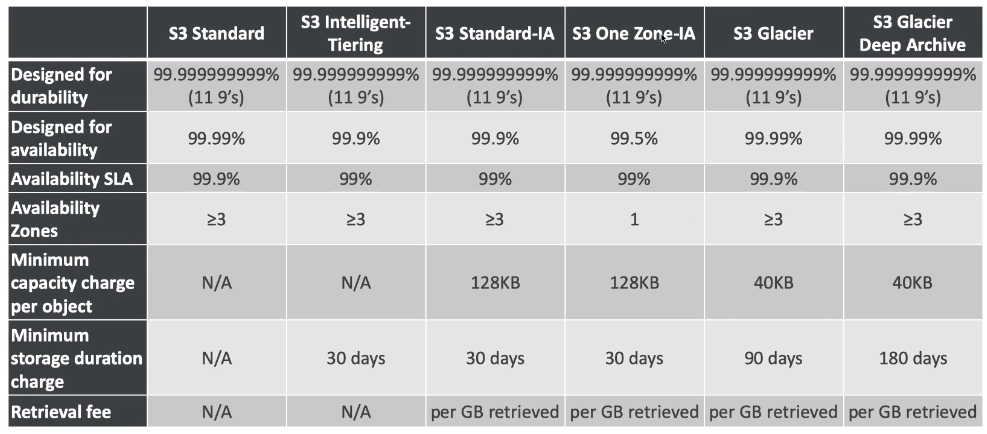
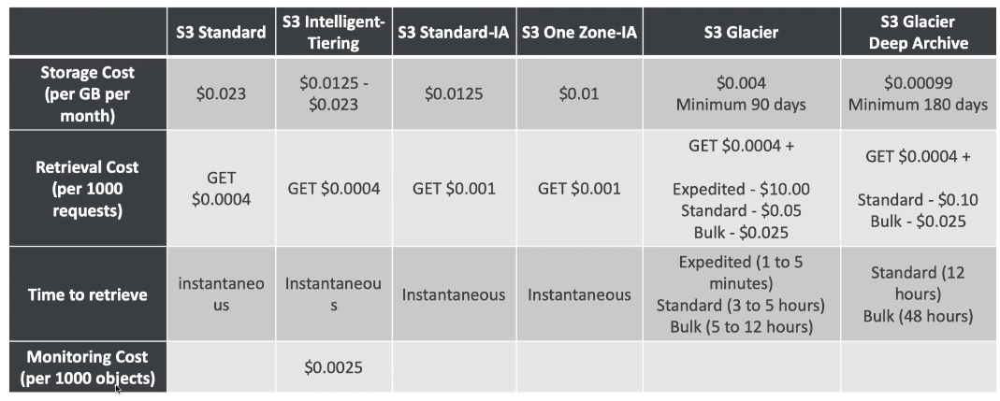
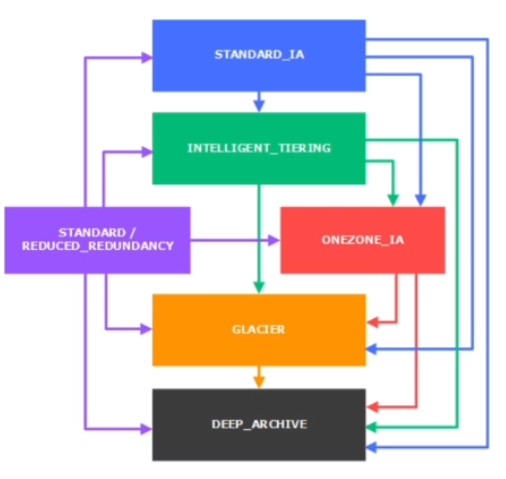

# AWS::S3::Bucket

- Store `objects` (files) in `buckets` (directories)
- Buckets have a globally unique name
- All operations are `strong consistent`: after write/delete in an object (PUT/DELETE), a subsequent read (GET) will have the latest version of the object
- **Objects**
  - `key`: the unique identification for the object is its `full path`. E.g., s3://my-bucket/my-folder/my-file.txt
  - `size`: Max object `size` is 5TB (but upload must happen with 5GB chunks)
  - `metadata`: list of key-value pairs
  - `tags`: up to 10
  - `version`: version id
- By default, S3 objects are `owned` by the `AWS account` that `uploaded` it!

```yaml
Type: AWS::S3::Bucket
Properties:
  AccelerateConfiguration: AccelerateConfiguration
  AccessControl: String
  AnalyticsConfigurations:
    - AnalyticsConfiguration
  BucketEncryption: BucketEncryption
  BucketName: String
  CorsConfiguration: CorsConfiguration
  IntelligentTieringConfigurations:
    - IntelligentTieringConfiguration
  InventoryConfigurations:
    - InventoryConfiguration
  LifecycleConfiguration: LifecycleConfiguration
  LoggingConfiguration: LoggingConfiguration
  MetricsConfigurations:
    - MetricsConfiguration
  NotificationConfiguration: NotificationConfiguration
  ObjectLockConfiguration: ObjectLockConfiguration
  ObjectLockEnabled: Boolean
  OwnershipControls: OwnershipControls
  PublicAccessBlockConfiguration: PublicAccessBlockConfiguration
  ReplicationConfiguration: ReplicationConfiguration
  Tags:
    - Tag
  VersioningConfiguration: VersioningConfiguration
  WebsiteConfiguration: WebsiteConfiguration
```

- **MFA Delete**

  - Multiple confirmations required for deleting
  - To permanently delete a version, to suspend the versioning, etc
  - Only root account can enable/disable this option through the CLI

  ```sh
  # enable MFA delete (must be root account)
  aws s3api put-bucket-versioning \
    --bucket "my-bucket" \
    --versioning-configuration "Status=Enabled,MFADelete=Enabled"
  ```

- **Requester Pays**

  - Charger the `3rd party` who is willing to request data to your bucket for the `network costs` only
  - The owner will pays for the `storage costs`
  - requester must be authenticated in AWS

  

- **Pre-signed URL**

  - `Pre-Signed URL`: URLs valid for a limited time (3600s by default)
  - For downloads, CLI can be used
  - For uploads, SDK can be used

  - Access multiple operations GET, PUT, POST, ...

  ```sh
  # generate pre-signed URL for an object
  aws s3 presign "s3://mybucket/myobject.txt" --region "sa-east-1"
  aws s3 presign "s3://mybucket/myobject.txt" --region "sa-east-1" --expires-in "300" # 3600 by default
  ```

- **Performance**

  - `3500` PUT/COPY/POST/DELETE per second per prefix
  - `5000` GET/HEAD per second per prefix

  - `KMS` limits the performance because KMS has a per-request quota
    

  - `Multi-part upload`

    - It is recommended for files > 100MB and required for files > 5GB
    - It parallelize the upload and achieve higher throughput

  - `S3 Byte-Range Fetches`

    - Optimizes READ
    - Parallelize GET requests
    - Can also be used to retrieve only a part of the file (e.g., only the header)

  - `S3 Select & Glacier Select`

    - Allow queries to the S3 using `SQL language` (server-side filtering)
    - Avoid unnecessary data filtering by the application
    - Can also search in a csv file
    - Less network traffic!
      

## AccelerateConfiguration

- `S3 Transfer Acceleration` (S3TA)
- Increase transfer speed
- Transfer to `AWS edge location` and forwards to target region
  
- With S3TA, you pay only for transfers that are accelerated

## BucketEncryption

- **SSE-S3**
  - Keys managed by AWS
  - SSE: server side encryption
  - Header "x-amz-server-side-encryption":"AES256"
- **SSE-KMS**
  - Encryption and keys managed by KMS (key management service)
  - User control, audit trail support, rotation policy of the key
  - Header "x-amz-server-side-encryption":"aws:kms"
- **SSE-C**
  - You manage your own keys
  - Through CLI or SDK only (not console)
  - HTTPS is mandatory because you have to pass the key to aws
  - Key must be provided in the header in every request
  - AWS just use the key to encrypt and discard it
  - Header "x-amz-server-side-encryption":"aws:c"
- **Client Side Encryption**

  - You encrypt the data and send it
  - S3 encryption SDK can help with that

- A `default encryption method` can be set for all files. Also, different methods can override the default encryption for each single file and version

## CorsConfiguration

- CORS (`Cross-Origin Resource Sharing`): get resource from another origin
- `Web Browser Policy`: allow requests to other origins only if this origin being requested allows CORS
- `Origin`: scheme (protocol) + host (domain) + port. E.g., <https://www.example.com:443>

  - Same origin: <http://example.com/app1> & <http://example.com/app2>
  - Different origins: <http://example.com/> & <http://other.example.com/>

- **Preflight Request**

  - The browser will perform a `preflight request` to the target origin in order to check if it allows CORS.
  - It's a `OPTIONS` request with `Host` (target origin) and `Origin` (source origin)
  - The target origin responds with the allowed methods
    - `Access-Control-Allow-Origin: http://www.source-origin.com`
    - `Access-Control-Allow-Methods: GET, PUT, DELETE`

- **S3 CORS**

  - CORS must be enabled for the bucket in order to allow requests from other origins
  - CORS is enabled and defined under `permissions` config in the bucket

```json
[
  {
    "AllowedHeaders": ["Authorization"],
    "AllowedMethods": ["GET"],
    "AllowedOrigins": ["http://source-bucket.com"],
    "ExposeHeaders": [],
    "MaxAgeSeconds": 3000
  }
]
```

- This responds with the following headers:
  - `Access-Control-Allow-Origin: http://source-bucket.com/`
  - `Access-Control-Allow-Methods: GET`



```html
<html>
  <head>
    <title>My First Webpage</title>
  </head>
  <body>
    <h1>I love coffee</h1>
    <p>Hello world!</p>
  </body>
  

  <!-- CORS demo -->
  <div id="tofetch" />
  <script>
    var tofetch = document.getElementById("tofetch");

    // load from URL in the same origin
    fetch("extra-page.html")
      .then((response) => {
        return response.text();
      })
      .then((html) => {
        tofetch.innerHTML = html;
      });

    // load from URL in different origin (CORS in the target origin must be enabled)
    fetch(
      "http://target-bucket.s3-website-eu-west-1.amazonaws.com/extra-page.html"
    )
      .then((response) => {
        return response.text();
      })
      .then((html) => {
        tofetch.innerHTML = html;
      });
  </script>
</html>
```

## LifecycleConfiguration

- StorageClass
  - **Standard - General Purpose**
    - Durability 99.999999999%
    - Availability 99,99%
    - Use cases: big data analytics, mobile&gaming apps, content distribution
  - **Standard - Infrequent Access** (IA)
    - Infrequent access, but rapid access when needed
    - Availability 99,9%
    - Use cases: backups
  - **Intelligent Tiering**
    - Small monthly fee for monitoring and auto-tiering
    - Automatically move objects between tiers. E.g. GA -> IA
    - Availability 99,9%
  - **One Zone - Infrequent Access** (IA)
    - Same as Standard IA but in a single AZ
    - Availability 99,5%
    - Use cases: secondary backup
  - **Glacier**
    - $0.004/GB + retrieval cost
    - Each archive has up to 40 TB
    - Archive are stored in vaults
    - Retrieval options: expedited (1-5min), standard (3-5h), bulk (5-12h)
    - Minimum storage duration of 90 days
  - **Glacier Deep Archive**
    - Even cheaper!
    - Retrieval options: standard (12h), bulk (48h)
    - Minimum storage duration of 180 days





- The `storage class` of an object can be set for each file (upon uploading or afterwards)

- **Lifecycle Rules**

  - Lifecycle rules can be created under Management Tab
  - `S3 Analytics` can be setup to automatically transition objects. Only Standard to Standard-IA
  - `Transition actions`: E.g., move to Standard IA 60 days after creation and to glacier 6 months after

    - `Transition current versions` of objects between storage classes
    - `Transition previous versions` of objects between storage classes
    - `Expire current versions` of objects
    - `Permanently delete previous versions` of objects
    - `Delete expired delete markers` or incomplete multipart uploads



## LoggingConfiguration

- `Access Logs` can be stored in another s3 bucket. Do not store it in the same bucket otherwise it will loop forever
- `API calls` can be logged in `cloudtrail`
- Can be activated under `Server Logging Access` in propeties tab

## NotificationConfiguration

- **S3 Event Notifications**
- `S3:ObjectCreated`, `S3:ObjectRemoved`, ...
- Events notification is defined under properties tab
- Rules can be applied to monitor only certain objects
- Example of event notification use: generate thumbnail as soon as a jpg file is created in the bucket

- Events can be sent to `SNS`, `SQS` or `Lambda Funcions` in order for the event to be further processed
- The target broker (SNS, SQS, etc) must have access policies to allow s3 to publish in it

## ObjectLockConfiguration

- Places an `Object Lock` configuration on the specified bucket.
- The default retention can also be override when you `explicitly` apply a `retention period` to an object version (**Retain Until Date**)
- Different versions of an object can have different retention modes and periods

- The rule specified in the Object Lock configuration will be `applied by default to every new object` placed in the specified bucket

- The **DefaultRetention** specifies:

  - _Mode_
    - `GOVERNANCE`: users can't modify or delete versions
    - `COMPLIANCE`: versions can't be overwritten (even by root)
  - _Period_
    - `Retention Period`
    - `Legal Hold` (no expiry date)

- For `archives` you can add **Vault Lock** and adopt `WORM` (write once read many)
- This way your archive cannot be modified/deleted. Good for compliance & audit!

## PublicAccessBlockConfiguration

- Configuration to block `public access` to objects
- This is used to prevent `data leaks`
- This configuration can also be applied at the `account level` (for all buckets)

## ReplicationConfiguration

- `CRR`: Cross Region Replication
- `SRR`: Same Region Replication

- Copy is asynchronous
- Versioning must be enabled in order to replicate
- S3 must have proper `IAM permissions`
- Uses cases: compliance, lower latency
- After activating, only `new objects` are replicated
- Replication `cannot be chained`! Replica from 1 to 2 won't replicate from 2 to 3

- **Replication rule**
  - It's configured under `replication rules` in Management Tab
  - Replication can be activated for all objects or specific objects with filter
  - For `DELETE` operations, you can choose whether the delete markers will be replicated

## VersioningConfiguration

- Once you version-enable a bucket, it can `never return to an unversioned state`
- Versioning can only be `suspended` once it has been enabled. `Suspending` the versioning won't remove the versions already created
- With versioning, you can easily `recover` from both unintended user actions and application failures
- When overriding a file, a `new version` is created
- Objects with `version id null` means they were created when versioning was not activated
- Deleted objects receive a `delete marker`. And the previous versions of it are preserved. To delete an object completely, all the versions must be deleted

## WebsiteConfiguration

- S3 can host static websites and have them accessible on the www
- <my-bucket.s3-website.sa-east.amazonaws.com>
- Under bucket properties, `static website hosting` must be activated
- `block public access` must be disabled
- A `bucket policy` must enable access to its files

```json
{
  "Id": "Policy1633026957759",
  "Version": "2012-10-17",
  "Statement": [
    {
      "Sid": "Stmt1633026955731",
      "Action": ["s3:GetObject"],
      "Effect": "Allow",
      "Resource": "arn:aws:s3:::hvitoi/*",
      "Principal": "*"
    }
  ]
}
```

```html
<html>
  <head>
    <title>My First Webpage</title>
  </head>
  <body>
    <h1>I love coffee</h1>
    <p>Hello world!</p>
  </body>
  
</html>
```
