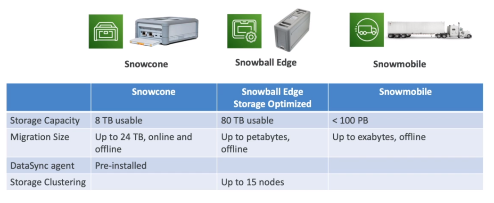
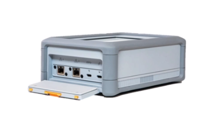
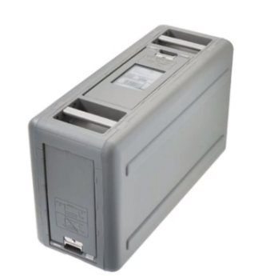
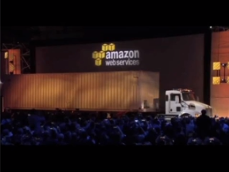

# AWS Snow Family

- Offline devices to perform data migration
- It's a physical device that is shipped by post
- Snow devices must be requested from AWS console
- To load data, `AWS OpsHub` must be installed (optionally use CLI)

## Family Jobs

- Import into Amazon S3
- Export from Amazon S3
- Local compute and storage only

## Snow Devices

- **Data migration**
  - Snowcone
  - Snowball Edge
  - Snowmobile
- **Edge Computing**: process data while being created
  - Snowcone
  - Snowball Edge

## Snowcone

- Small portable computer (2.1kg)
- 8TB HDD, 2CPUs, 4 GB RAM
- Withstands harsh environments
- Can be sent offline or via network

## Snowball Edge

- `Snowball Edge Storage Optimized`
  - 80TB, 40 vCPUs, 80GB RAM
  - Can run EC2 instances & aws functions with `IoT Greengrass`
- `Snowball Edge Compute Optimized`
  - 42TB, 52vCPUs, 208GB RAM, `optional GPU`
  - Can run EC2 instances & aws functions with `IoT Greengrass`

## Snowmobile

- An actual truck
- 100PB

