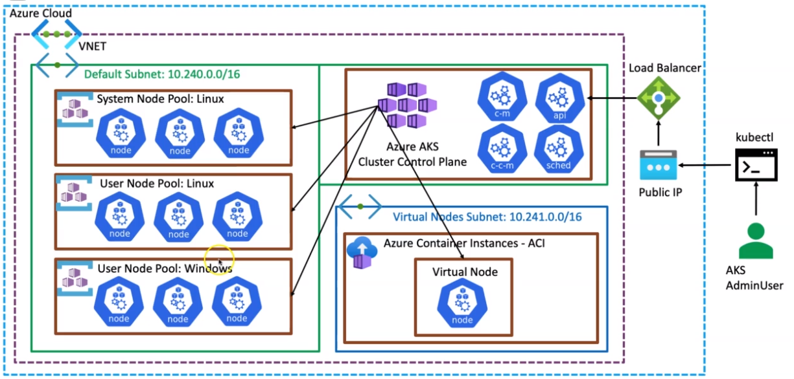

# aks

## get-credentials

```sh
# Get the credentials (kubeconfig) of the cluster
az aks get-credentials \
  --resource-group "aks-rg" \
  --name "aks-cluster" \
  --overwrite-existing \
  --admin # log as standard k8s admin (no AD)
```

## get-versions

```sh
# Ger available kubernetes versions
az aks get-versions --location "southcentralus" -o table
```

## show

```sh
# Show the RG in which external cloud resources (PVs, Public IPs, etc) are created
az aks show \
  --resource-group "demo-rg" \
  --name "aksdemo" \
  --query "nodeResourceGroup" \
  -o tsv

# Addon info
az aks show \
  --resource-group "demo-rg" \
  --name "aksdemo" \
  --query "addonProfiles.httpapplicationrouting.config.HTTPApplicationRoutingZoneName" \
  -o table
```

## create

```sh
# Create Kubernetes Cluster
az aks create \
  --resource-group "demo-rg" \
  --name "demo-k8s" \
  --node-count "1" \
  --enable-addons "monitoring" \
  --enable-managed-identity \ # always prefer!
  --generate-ssh-keys \ # create id_rsa in ~/.ssh to access the nodepool machines
  --enable-cluster-autoscaler \
  --min-count "1" \
  --max-count "5"
```

## update

```sh
# Allow AKS cluster to pull images without username/password
az aks update \
  --resource-group "demo-rg" \
  -n "akscluster" \
  --attach-acr "hvitoi" # hvtoi.azurecr.io

# Detach
az aks update \
  --resource-group "demo-rg" \
  -n "akscluster" \
  --detach-acr "hvitoi"
```

## delete

```sh
# Delete Cluster
az aks delete \
  --resource-group "aks-rg" \
  --name "aks-cluster"
```

## nodepool

```sh
# List nodepools
az aks nodepool list \
  --resource-group "aks-rg" \
  --cluster-name "aks-cluster" \
  --output "table"

# Create linux user nodepool
az aks nodepool add \
  --resource-group "aks-rg" \
  --cluster-name "aks-cluster" \
  --name "linuxpool" \
  --mode "User" \
  --node-count "1" \
  --enable-cluster-autoscaler \
  --max-count "5" \
  --min-count "1" \
  --node-vm-size "Standard_DS2_v2" \
  --os-type "Linux" \
  --labels "nodepool-type=user" "environment=production" "nodepoolos=linux" "app=java-apps" \
  --tags "nodepool-type=user" "environment=production" "nodepoolos=linux" "app=java-apps" \
  --zones {1,2,3}

# Create windows user nodepool
az aks nodepool add \
  --resource-group "aks-rg" \
  --cluster-name "aks-cluster" \
  --name "win" \
  --mode "User" \
  --node-count "1" \
  --enable-cluster-autoscaler \
  --max-count "5" \
  --min-count "1" \
  --node-vm-size "Standard_DS2_v2" \
  --os-type "Windows" \
  --labels "nodepool-type=user" "environment=production" "nodepoolos=windows" "app=dotnet-apps" \
  --tags "nodepool-type=user" "environment=production" "nodepoolos=windows" "app=dotnet-apps" \
  --zones {1,2,3}
```

## enable-addons

```sh
# http_application_routing
az aks enable-addons \
  --resource-group "aks-rg" \
  --name "aks" \
  --addons "http_application_routing"

# virtual-node
az aks enable-addons \
    --resource-group "aks-rg" \
    --name "aks-cluster" \
    --addons "virtual-node" \
    --subnet-name "aks-subnet-vnodes" # aks-cluster must have access to this subnet
```

## Connection with ACR

- It must be given permissions to the Kubernetes Cluster to access ACR

- **With Secrets & Service Principal**

```sh
# Create service principal
az ad sp create-for-rbac \
  --name "http://my-service-principal-name" \
  --scopes "/subscriptions/acr-registry-id/..." \
  --role "acrpull" \
  --query "password" \
  --output "tsv" # outputs the autogenerated password

# Show service principal
az ad sp show \
  --id "http://my-service-principal-name" \
  --query "appId" \
  --output "tsv" # outsputs the id of newly created principal
```

```sh
# Get clientId of the AKS "Service Principal"
SERVICE_PRINCIPAL_NAME=$(az aks show --resource-group "demo-rg" --name "demo-k8s" --query "servicePrincipalProfile.clientId" --output tsv)

# Get ACR resource Id
ACR_ID=$(az acr show --resource-group "demo-rg" --name "hvitoi" --query "id" --output tsv)

# Assign role to an existing "Service Principal" (which is used by aks)
az role assignment create \
  --assignee $SERVICE_PRINCIPAL_NAME \
  --scope $ACR_ID \
  --role "acrpull"
```

```sh
# Create create with the service principal
kubectl create secret docker-registry "my-acr-secret" \
    --docker-server "container-registry-name.azurecr.io" \
    --docker-username "service-principal-ID" \
    --docker-password "service-principal-password"
```

```yaml
apiVersion: v1
kind: Pod
metadata:
  name: nginx-pod
spec:
  containers:
    - name: nginx-container
      image: private-registry.io/apps/internal-app:1.0.0
  imagePullSecrets:
    - name: my-acr-secret
```

- **With AKS-ACR Integration**

```sh
# Allow AKS cluster to pull images without username/password
az aks update \
  --resource-group "demo-rg" \
  -n "akscluster" \
  --attach-acr "hvitoi" # hvtoi.azurecr.io

# Detach
az aks update \
  --resource-group "demo-rg" \
  -n "akscluster" \
  --detach-acr "hvitoi"
```

## AKS cluster from Scratch



```sh
# Resource Group
az group create \
  --name "aks-rg" \
  --location "southcentralus"
```

```sh
# Create Virtual Network and a Default Subnet
az network vnet create \
  --resource-group "aks-rg" \
  --name "aks-vnet" \
  --address-prefix "10.0.0.0/8" \
  --subnet-name "aks-subnet-default" \
  --subnet-prefix "10.240.0.0/16"

# Create Subnet for Virtual Nodes
az network vnet subnet create \
  --resource-group "aks-rg" \
  --vnet-name "aks-vnet" \
  --name "aks-subnet-vnodes" \
  --address-prefixes "10.241.0.0/16"
```

```sh
# Azure AD Group
az ad group create \
  --display-name "aks-admins" \
  --mail-nickname "aks-admins" \
  --query "objectId" \
  --output "tsv"

# Azure AD User
az ad user create \
  --display-name "henry" \
  --user-principal-name "henry@hvitoioutlook.onmicrosoft.com" \
  --password "pass1234." \
  --query "objectId" \
  --output "tsv"

# Associate user to a group
az ad group member add \
  --group "aks-admins" \
  --member-id "user-id" # replace with output from above
```

```sh
# SSH keys
ssh-keygen \
    -m "PEM" \
    -t "rsa" \
    -b "4096" \
    -C "aksuser@myserver" \
    -f "./aks-rsa" \
    -N "mypassphrase" # generates aks-rsa & aks-rsa.pub
```

```sh
# Log Analytics Workspace
az monitor log-analytics workspace create \
  --resource-group "aks-rg" \
  --workspace-name "aks-loganalyticsworkspace" \
  --query "id" \
  --output "tsv"
```

```sh
# Get Azure Active Directory ID - AD Tenant ID
az account show \
  --query "tenantId" \
  --output "tsv"

# AKs group object ID
 az ad group show \
  --group "aks-admins" \
  --query "objectId" \
  --output "tsv"

# VNet Default subnet ID
az network vnet subnet show \
  --resource-group "aks-rg" \
  --vnet-name "aks-vnet" \
  --name "aks-subnet-default" \
  --query "id" \
  --output "tsv"

# Log Analytics Workspace ID
az monitor log-analytics workspace show \
  --resource-group "aks-rg" \
  --workspace-name "aks-loganalyticsworkspace" \
  --query "id" \
  --output "tsv"
```

```sh
az aks create \
  --resource-group "aks-rg" \
  --name "aks-cluster" \
  --enable-managed-identity \
  --ssh-key-value "./aks-rsa.pub" \
  --admin-username "linux-node-admin" \
  --windows-admin-username "windows-node-admin" \
  --windows-admin-password "windowspass1234." \
  --node-count "1" \
  --node-osdisk-size "30" \
  --node-vm-size "Standard_DS2_v2" \
  --enable-cluster-autoscaler \
  --min-count "1" \
  --max-count "100" \
  --network-plugin "azure" \
  --service-cidr "10.0.0.0/16" \
  --dns-service-ip "10.0.0.10" \
  --docker-bridge-address "172.17.0.1/16" \
  --vnet-subnet-id "/subscriptions/c903ad61-2a3e-49b1-ad34-8affe3fdb1df/resourceGroups/aks-rg/providers/Microsoft.Network/virtualNetworks/aks-vnet/subnets/aks-subnet-default" \
  --enable-aad \
  --aad-admin-group-object-ids "c19a51f9-b48b-489a-bd1f-9d21895f0290" \
  --aad-tenant-id "713b8495-6d18-456c-a49e-1cfd44e79b2e" \
  --nodepool-name "systempool" \
  --nodepool-labels "nodepool-type=system" "nodepoolos=linux" "app=system-apps" \
  --nodepool-tags "nodepool-type=system" "nodepoolos=linux" "app=system-apps" \
  --workspace-resource-id "/subscriptions/c903ad61-2a3e-49b1-ad34-8affe3fdb1df/resourcegroups/aks-rg/providers/microsoft.operationalinsights/workspaces/aks-loganalyticsworkspace" \
  --enable-addons "monitoring" \
  --enable-ahub \
  --zones {1,2,3}


# Additional options
--enable-private-cluster \ # restrict kube-apiserver access
--api-server-authorized-ip-ranges "0.0.0.0/0" \
--kubernetes-version "1.21.2" \
--outbound-type "loadBalancer" \
--load-balancer-sku "standard" \
--load-balancer-managed-outbound-ip-count "5" \
--load-balancer-idle-timeout "5" \
--load-balancer-outbound-ports "1024" \

```

- When using `SYSTEM assigned identity`, azure-cli will grant "Network Contributor" role to it
- Optionally use `USER assigned identity` (--assign-identity)

```sh
# get vnet id
az network vnet show \
  --resource-group "aks-rg" \
  --name "aks-vnet" \
  --query "id" \
  --output "tsv"

# get aks principal ID
az aks show \
  -g "aks-rg" \
  -n "aks-cluster" \
  --query "identity.principalId" \
  -o "tsv"

# Grant "Vnet contributor" to AKS cluster
az role assignment create \
  --assignee "3518f2e2-3bb5-4b8c-8fb4-7ed55881a424" \
  --scope "/subscriptions/c903ad61-2a3e-49b1-ad34-8affe3fdb1df/resourceGroups/aks-rg/providers/Microsoft.Network/virtualNetworks/aks-vnet" \
  --role "Contributor"
```

```sh
# Enable Virtual Nodepool
az aks enable-addons \
    --resource-group "aks-rg" \
    --name "aks-cluster" \
    --addons "virtual-node" \
    --subnet-name "aks-subnet-vnodes" # aks-cluster must have access to this subnet

# go to "aciconnectorlinux" managed identity and add role assignment, giving permissions (contributor role) to the "aks-rg" resource group
```

```sh
# Create linux user nodepool
az aks nodepool add \
  --resource-group "aks-rg" \
  --cluster-name "aks-cluster" \
  --name "linuxpool" \
  --mode "User" \
  --node-count "1" \
  --enable-cluster-autoscaler \
  --max-count "5" \
  --min-count "1" \
  --node-vm-size "Standard_DS2_v2" \
  --os-type "Linux" \
  --labels "nodepool-type=user" "environment=production" "nodepoolos=linux" "app=java-apps" \
  --tags "nodepool-type=user" "environment=production" "nodepoolos=linux" "app=java-apps" \
  --zones {1,2,3}
```

```sh
# Create windows user nodepool
az aks nodepool add \
  --resource-group "aks-rg" \
  --cluster-name "aks-cluster" \
  --name "win" \
  --mode "User" \
  --node-count "1" \
  --enable-cluster-autoscaler \
  --max-count "5" \
  --min-count "1" \
  --node-vm-size "Standard_DS2_v2" \
  --os-type "Windows" \
  --labels "nodepool-type=user" "environment=production" "nodepoolos=windows" "app=dotnet-apps" \
  --tags "nodepool-type=user" "environment=production" "nodepoolos=windows" "app=dotnet-apps" \
  --zones {1,2,3}
```
